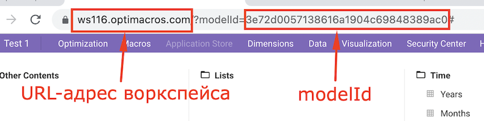
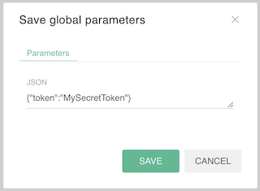
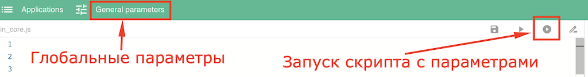
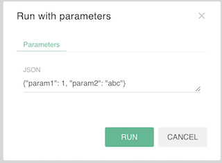

# API Reference

1. [Интерфейс Application manager (на языке TypeScript)](./declarations/om.d.ts)
1. [Соединение с моделью](#modelConnect)
1. [Доступ к входным параметрам](#inputParams)
1. [Запуск дочернего скрипта](#runScript)
1. [Вывод статусного сообщения](#status)
1. [Интерфейсы модели OM](./om.md)
1. [Веб-интерфейсы](./webHandlers.md)

&nbsp;

### Интерфейс OMStatic
```ts
export interface OMStatic {
    new (): OM;

    readonly params: Object;

    connect(https: string, wss: string, token: string, modelId: string, env?: Object): OM;
    connectAsync(https: string, wss: string, token: string, modelId: string, env?: Object): Promise<OM>;
    script(relativePathOrId: string, params: Object): EventPromise;
    status(...args: any[]): OM;
    web(eventName: string, callback: (request: OMWebRequest) => string | WebHandlerResponse): void;
}
```
Интерфейс `OMStatic` являет собой набор методов глобального объекта `OM` в системе Application Manager.

## Соединение с моделью<a name="modelConnect"></a>

```js
OM.connect(https: string, wss: string, token: string, modelId: string, env?: Object): OM
```
Устанавливает соединение с моделью `modelId` по адресу `https`, используя [WebSocket](https://ru.wikipedia.org/wiki/WebSocket) `wss` и токен пользователя `token`, и устанавливает в модели [переменные окружения](https://ru.wikipedia.org/wiki/%D0%9F%D0%B5%D1%80%D0%B5%D0%BC%D0%B5%D0%BD%D0%BD%D0%B0%D1%8F_%D1%81%D1%80%D0%B5%D0%B4%D1%8B) `env`. Возвращает ссылку на интерфейс модели [OM](./om.md#OM), [аналог](https://github.com/optimacros/scripts_documentation/blob/main/appendix/constraints.md#singleModel) глобальной переменной `om: OM` скриптов 1.0.

- `https` - URL-адрес воркспейса с указанием протокола HTTP/HTTPS.
- `wss` - URL-адрес воркспейса с указанием протокола WS/WSS.
- `token` - токен пользователя для доступа к данным модели. Это уникальная секретная строка, которую можно получить в профиле пользователя через «Логин-центр» (Create Named Token). Токен может быть создан только администратором ЛЦ и имеет ограничение по времени жизни, которое нужно выбрать при его создании.
- `modelId` - идентификатор модели. Индентификатор можно узнать в адресной строке браузера.
- `env` - переменные окружения, которые будут переданы в модель после установки соединения. Доступ к переменным окружения можно получить с помощью интрефейса [Environment](./env.md#Environment). *Опциональный параметр.*

**Внимание!** Токен пользователя обязательно должен быть передан в скрипт как [входной параметр](#params), иначе ваш личный секретный токен может увидеть любой пользователь, у которого есть доступ к коду вашего приложения!

### Пример установки соединения и получения ссылки на интерфейс модели.

1. Получаем URL-адрес воркспейса и идентификатор модели.



2. Задаем токен пользователя в модальном окне `General parameters` в системе Application Manager.



3. Запускаем скрипт с параметрами.

```js
const om = OM.connect(
    'https://ws116.optimacros.com/',
    'wss://ws116.optimacros.com/ws',
    OM.params.token,
    '3e72d0057138616a1904c69848389ac0',
    {param1: 1, param2: 'abc'}
);
```
В результате в переменную `om` будет записана ссылка на интерфейс модели [OM](./API.md#OM). В модели будут установлены переменные окружения `param1` и `param2`.

&nbsp;

### Асинхронная операция соединения <a name="connectAsync"></a>

```js
OM.connectAsync(https: string, wss: string, token: string, modelId: string, env?: Object): Promise<OM>
```
Выполняет асинхронную операцию соединения с моделью. Возвращает ссылку на объект [Promise](https://developer.mozilla.org/ru/docs/Web/JavaScript/Reference/Global_Objects/Promise). Чтобы получить соединение с моделью, необходимо дождаться, когда `промис` завершиться. 

При создании соединения с помощью `connectAsync` отключаются и выдают ошибку все синхронные методы всех интерфейсов API, их асинхронные пары продолжают работать.

&nbsp;

## Доступ к входным параметрам<a name="inputParams"></a>

```js
OM.params: Object
```
Позволяет получить доступ к параметрам, переданным в скрипт при его запуске в виде [JSON](https://habr.com/ru/post/554274/) объекта.

`Запуск скрипта с параметрами` позволяет передать в скрипт входные параметры. В системе Application Manager параметры задаются в виде [JSON](https://habr.com/ru/post/554274/) объекта в модальном окне `General parameters` или в модальном окне при запуске скрипта.



Окно ввода параметров в JSON формате.



&nbsp;

## Запуск дочернего скрипта<a name="runScript"></a>

```js
OM.script(relativePathOrId: string, params: Object): EventPromise
```
Запускает скрипт `relativePathOrId` с [входными параметрами](#inputParams) `params`. В качестве параметра `relativePathOrId` можно передать идентификатор скрипта, существующего в Application Manager (скрипт может находиться в другом приложении), или относительный путь к скрипту в текущем приложении. **Важно! Скрипт должен быть исполняемым.** Список исполняемых скриптов и их идентификаторы можно найти в модальном окне `Edit Application` на вкладке `Executable Scripts`.

Метод возвращает ссылку на объект класса `EventPromise`. Родительский скрипт может ждать результата выполнения дочернего скрипта или продолжить работу параллельно с дочерним скриптом.

### Класс EventPromise<a name="EventPromise"></a>
```ts
class EventPromise extends EventEmitter {
    then(callback: (result: any) => void): this;
    catch(callback: (error: any) => void): this;
}
```
Комбинация возможностей обычного [Promise](https://developer.mozilla.org/ru/docs/Web/JavaScript/Reference/Global_Objects/Promise) с возможностью подписываться на результат или ожидать с помощью [await](https://developer.mozilla.org/ru/docs/Web/JavaScript/Reference/Operators/await) и [EventEmitter](https://nodejsdev.ru/doc/event-emitter/#eventemitter) генерирующего события из источника. ***Описание данного класса находится в доработке.***

&nbsp;

## Вывод статусного сообщения<a name="status"></a>

```js
OM.status(...args: any[]): OM
```
Устанавливает статусное сообщение `args`. Если `args` задано в виде массива, то выводит элементы в заданном порядке, разделяя их пробелом. Имеет смысл во время длительной работы скриптов сообщать пользователю об этапах или процентах выполненных работ. Аналог метода [setStatusMessage](https://github.com/optimacros/scripts_documentation/blob/main/API/common.md#RequestManager.setStatusMessage) в Скриптах 1.0. ***Не реализовано, выводит подсвеченное зеленым цветом сообщение в терминале вывода.***

&nbsp;

[Оглавление](../README.md)
