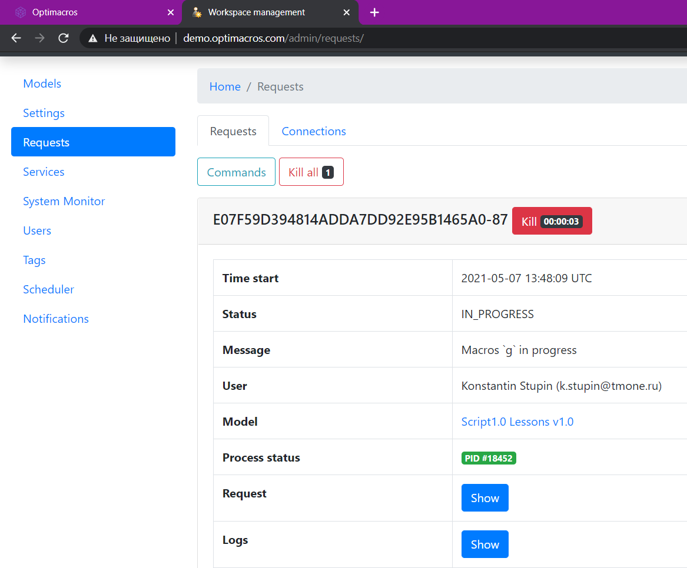

# Интерфейс Common

### Интерфейс Common<a name="common"></a>
```ts
interface Common {
	createCellBuffer(): CellBuffer;
	requestInfo(): RequestManager;
	modelInfo(): ModelInfo;
	userInfo(): UserInfo;
	resultInfo(): ResultInfo;
	entitiesInfo(): EntitiesInfo;
	copyData(): CopyData;
	scriptsTab(): ScriptsTab;
}
```
Интерфейс, группирующий некоторые общие интерфейсы, не связанные друг с другом.

&nbsp;

```js
createCellBuffer(): CellBuffer
```
Возвращает ссылку на интерфейс [`CellBuffer`](#cell-buffer).

&nbsp;

```js
requestInfo(): RequestManager
```
Возвращает ссылку на интерфейс [`RequestManager`](#request-manager).

&nbsp;


```js
modelInfo(): ModelInfo
```
Возвращает ссылку на интерфейс [`ModelInfo`](#model-info).

&nbsp;

```js
userInfo(): UserInfo
```
***Не реализовано.***

Возвращает ссылку на интерфейс [`UserInfo`](#user-info).

&nbsp;

```js
resultInfo(): ResultInfo
```
Возвращает ссылку на интерфейс [`ResultInfo`](#result-info).

&nbsp;

```js
entitiesInfo(): EntitiesInfo
```
***Не реализовано.***

Возвращает ссылку на интерфейс [`EntitiesInfo`](#entities-info).

&nbsp;

```js
copyData(): CopyData
```
***Не реализовано.***

Возвращает ссылку на интерфейс [`CopyData`](#copy-data).

&nbsp;

```js
scriptsTab(): ScriptsTab;
```

Возвращает ссылку на интерфейс [`ScriptsTab`](scriptsTab.md#scripts-tab).

&nbsp;

### Интерфейс CellBuffer<a name="cell-buffer"></a>
```ts
interface CellBuffer {
	set(cell: Cell | CubeCell, value: number | string | null): CellBuffer;
	apply(): CellBuffer;
	async applyAsync(): Promise<CellBuffer>;
	count(): number;
	canLoadCellsValues(value: boolean): CellBuffer;
}
```
Буфер, куда можно временно поместить значения набора ячеек, не обязательно смежных, чтобы изменить их перед отправкой на сервер.

В один буфер можно помещать запросы за изменение ячеек, принадлежащих разным представлениям одного объекта (мультикуба или справочника) и даже разным объектам. Однако в последнем случае следует понимать, что если между объектами (например, мультикубами `мк1` и `мк2`) существует связь, которая может привести к пересчёту значений, то последовательность действий

```
* запись в `CellBuffer` ячеек `мк1`
* запись в `CellBuffer` ячеек `мк2`
* вызов `CellBuffer.apply()`
```

и последовательность

```
* запись в `CellBuffer` ячеек `мк1`
* вызов `CellBuffer.apply()`
* запись в `CellBuffer` ячеек `мк2`
* вызов `CellBuffer.apply()`
```

При модификации большого количества клеток (от нескольких сотен тысяч), рекомендуется пользоваться [`импортом CSV`](./exportImport.md#importer).

Работа асинхронных функций описана [`здесь`](./webHandlers.md#async).

&nbsp;

```js
set(cell: Cell | CubeCell, value: number | string | null): CellBuffer
```
Устанавливает значение `value` в клетку `cell` в буфере. Возвращает `this`.

&nbsp;

<a name="apply"></a>
```js
apply(): CellBuffer
async applyAsync(): Promise<CellBuffer>
```
Передаёт на сервер значения всех клеток для присваивания в модели и очищает буфер. Перед присваиванием сервер может их обработать и выставить другие значение, например, после установки в ячейку формата даты строки `'2019-03-01'` впоследствии из неё будет считана строка `'1 Mar 19'`. Возвращает `this`.

&nbsp;

```js
count(): number
```
Возвращает количество ячеек в буфере.

&nbsp;

```js
canLoadCellsValues(value: boolean): CellBuffer
```
Устанавливает значение `value`, указывающее, нужно ли перезагружать значения клеток в буфере, если они изменятся. Возвращает `this`.

По умолчанию: `true`. Однако такое поведение сохранено лишь для обратной совместимости, оно приводит к деградации производительности. Поэтому рекомендуется сразу после инициализации объекта вызывать эту функцию и передавать `false`.

&nbsp;

&nbsp;

### Интерфейс RequestManager<a name="request-manager"></a>
```ts
interface RequestManager {
	log(message: string, print?: boolean): RequestManager;
	logStatusMessage(message: string, print?: boolean): RequestManager;
	setStatusMessage(message: string): RequestManager;
}
```
Интерфейс для записи в лог (устаревший функционал) и работы со статусными сообщениями. Все функции возвращают `this`.

&nbsp;

```js
log(message: string, print?: boolean): RequestManager
```
Выводит сообщение `message` в лог, доступ к которому можно получить в админке. Если `print === true` (по умолчанию: `false`), дублирует `message` в консоль и дополнительно переносит курсор на новую строку. *Устаревшая функция.*



&nbsp;

<a name="request-manager.log-status-message"></a>
```js
logStatusMessage(message: string, print?: boolean): RequestManager
```
Делает то же, что и `setStatusMessage()`. Если `print === true` (по умолчанию: `false`), дублирует `message` в консоль и дополнительно переносит курсор на новую строку. *Устаревшая функция.*

&nbsp;

<a name="request-manager.set-status-message"></a>
```js
setStatusMessage(message: string): RequestManager
```
Устанавливает статусное сообщение `message`. Имеет смысл во время длительной работы скриптов сообщать пользователю об этапах или процентах выполненных работ.


### Интерфейс ExportObfuscationState<a name="export-obfuscation-state"></a>
```ts
interface ExportObfuscationState {
	setPath(path: string): ExportObfuscationState;
	setEmailWhiteList(emailWhiteList: string[]): ExportObfuscationState;
	setDataArchiveType(type: string): ExportObfuscationState;
	export(): boolean;
}
```
Интерфейс для экспорта модели в [`обфусцированном`](https://ru.wikipedia.org/wiki/%D0%9E%D0%B1%D1%84%D1%83%D1%81%D0%BA%D0%B0%D1%86%D0%B8%D1%8F_(%D0%BF%D1%80%D0%BE%D0%B3%D1%80%D0%B0%D0%BC%D0%BC%D0%BD%D0%BE%D0%B5_%D0%BE%D0%B1%D0%B5%D1%81%D0%BF%D0%B5%D1%87%D0%B5%D0%BD%D0%B8%D0%B5)) состоянии. Используется для передачи моделей, содержащих конфиденциальную информацию, третьим лицам.

&nbsp;

```js
setPath(path: string): ExportObfuscationState
```
Устанавливает путь к файлу модели. Возвращает `this`.

&nbsp;

```js
setEmailWhiteList(emailWhiteList: string[]): ExportObfuscationState
```
Устанавливает список email пользователей модели, которые *не* будут обфусцированы. Возвращает `this`.

&nbsp;

```js
setDataArchiveType(type: string): ExportObfuscationState
```
Устанавливает тип формата выгруженных данных модели. Допустимые значения: `TXT`, `BIN`. Значение по умолчанию: `BIN`. Возвращает `this`.

&nbsp;

```js
export(): boolean
```
Экспортирует модель и возвращает `true`.

&nbsp;

### Интерфейс ModelInfo<a name="model-info"></a>
```ts
interface ModelInfo {
	id(): string;
	
	name(): string;
	async nameAsync(): Promise<string>;
	
	lastSyncDate(): number;
	async lastSyncDateAsync(): Promise<number>;
	
	autoCalcStatus(): boolean;
	async autoCalcStatusAsync(): Promise<boolean>;
	
	setModelCalculationMode(status: boolean): boolean;
	async setModelCalculationModeAsync(status: boolean): Promise<boolean>;
	
	repair(): boolean;
	async repairAsync(): Promise<boolean>;
	
	recalculate(): boolean;
	async recalculateAsync(): Promise<boolean>;
	
	backup(): boolean;
	async backupAsync(): Promise<boolean>;
	
	exportObfuscationState(): ExportObfuscationState;
}
```
Интерфейс получения информации о модели и произведения с ней некоторых манипуляций.

Работа асинхронных функций описана [`здесь`](./webHandlers.md#async).

&nbsp;

```js
id(): string
```
Возвращает `id` модели.

&nbsp;

```js
name(): string
async nameAsync(): Promise<string>
```
Возвращает имя модели.

&nbsp;

```js
lastSyncDate(): number
async lastSyncDateAsync(): Promise<number>
```

Возвращает дату и время в формате [`UNIX`](https://ru.wikipedia.org/wiki/Unix-%D0%B2%D1%80%D0%B5%D0%BC%D1%8F) последнего пересчёта модели в ручном режиме.

&nbsp;

```js
autoCalcStatus(): boolean
async autoCalcStatusAsync(): Promise<boolean>
```
Возвращает признак режима автоматического пересчёта модели.

&nbsp;

```js
setModelCalculationMode(status: boolean): boolean
async setModelCalculationModeAsync(status: boolean): Promise<boolean>
```

Устанавливает признак режима автоматического пересчёта модели. Аналог в интерфейсе Optimacros: меню пользователя -> `Параметры` -> `Расширенные` -> `Режим ручного пересчёта модели`. Возвращает `true`.

&nbsp;

```js
repair(): boolean
async repairAsync(): Promise<boolean>
```

Делает резервную копию модели, останавливает все [`процессы`](https://ru.wikipedia.org/wiki/%D0%9F%D1%80%D0%BE%D1%86%D0%B5%D1%81%D1%81_(%D0%B8%D0%BD%D1%84%D0%BE%D1%80%D0%BC%D0%B0%D1%82%D0%B8%D0%BA%D0%B0)) ОС, которые обслуживают модель, запускает их заново и восстанавливает модель из копии. Аналог в интерфейсе Optimacros: меню пользователя -> `Перезапустить модель`. Возвращает `true`.

&nbsp;

```js
recalculate(): boolean
async recalculateAsync(): Promise<boolean>
```
Выполняет пересчёт модели в ручном режиме. Не останавливает процессы модели, за счёт чего выполняется значительно быстрее, чем `repair()`. Аналог в интерфейсе Optimacros: меню пользователя -> `Пересчитать модель`. Возвращает `true`.

&nbsp;

```js
backup(): boolean
async backupAsync(): Promise<boolean>
```

Сохраняет резервную копию модели. Посмотреть лог резервных копий в интерфейсе Optimacros можно так: Центр безопастности `->` Логи `->` Резервные копии. Возвращает признак успешного выполнения.

&nbsp;

```js
exportObfuscationState(): ExportObfuscationState
```
***Не реализовано.***

Возвращает интерфейс [`ExportObfuscationState`](#export-obfuscation-state) экспорта модели в обфусцированном состоянии.

&nbsp;

### Интерфейс UserInfo<a name="user-info"></a>

***Не применимо в Application Manager.***

```ts
interface UserInfo {
	getEntity(): EntityInfo;
	getEmail(): string;
	getFirstName(): string;
	getLastName(): string;
	getRole(): EntityInfo;
}
```
Интерфейс получения информации о пользователе.

&nbsp;

```js
getEntity(): EntityInfo
```
Возвращает сущность пользователя в виде [`EntityInfo`](./views.md#entity-info).

&nbsp;

```js
getEmail(): string
```
Возвращает email пользователя.

&nbsp;

```js
getFirstName(): string
```
Возвращает имя пользователя.

&nbsp;

```js
getLastName(): string
```
Возвращает фамилию пользователя.

&nbsp;

```js
getRole(): EntityInfo
```
Возвращает сущность роли пользователя в виде [`EntityInfo`](./views.md#entity-info).

&nbsp;

### Интерфейс ResultInfo<a name="result-info"></a>
```ts
interface ResultInfo {
	addFileHash(hash: string): ResultInfo;
	actionsInfo(): ResultActionsInfo;
	setProperty(name: string, value: any): ResultInfo;
}
```
Интерфейс управления ответом на запрос о запуске скрипта.

&nbsp;

<a name="result-info.add-file-hash"></a>
```js
addFileHash(hash: string): ResultInfo
```
***Не реализовано.***

Добавляет к ответу на запрос скрипта хэш `hash` файла, ранее зарегистрированного в [`глобальном реестре`](../appendix/glossary.md#global-file-registry). Для пользователя это приведёт к тому, что файл будет скачан в браузере. Возвращает `this`.

&nbsp;

```js
actionsInfo(): ResultActionsInfo
```
***Не реализовано.***

Возвращает интерфейс [`ResultActionsInfo`](./scriptChains.md#result-actions-info) создания действий, которые можно автомагически осуществить после исполнения текущего скрипта.

&nbsp;

```js
setProperty(name: string, value: any): ResultInfo
```
***Не применимо в Application Manager.***

Устанавливает свойству `name` значение `value` в HTTP-ответе на запрос о запуске скрипта приложением-клиентом (например, web-интерфейсом Optimacros). Возвращает `this`.

&nbsp;

### Интерфейс EntitiesInfo<a name="entities-info"></a>
```ts
interface EntitiesInfo {
	get(longId: number): EntityInfo | null;
	getCollection(longId: number[]): EntityInfo[];
}
```
Интерфейс для получения сущности по [`longId`](./views.md#long-id).

&nbsp;

```js
get(longId: number): EntityInfo | null
```
Возвращает сущность [`EntityInfo`](./views.md#entity-info) по её [`longId`](./views.md#long-id).

&nbsp;

```js
getCollection(longId: number[]): EntityInfo[]
```
Возвращает массив сущностей [`EntityInfo`](./views.md#entity-info) по массиву их [`longId`](./views.md#long-id).

&nbsp;

### Интерфейс CopyData<a name="copy-data"></a>

***Не реализовано.***

```ts
interface CopyData {
	setSourceLongId(longId: number): CopyData;
	setDestLongId(longId: number): CopyData;
	enableCustomProperties(): CopyData;
	enableCopyAllCubes(): CopyData;
	setMulticubeLongIds(longIds: number[]): CopyData;
	setMulticubeByNames(names: string[]): CopyData;
	copy(): CopyData;
}
```
Интерфейс, реализующий шаблон проектирования [`строитель`](https://ru.wikipedia.org/wiki/%D0%A1%D1%82%D1%80%D0%BE%D0%B8%D1%82%D0%B5%D0%BB%D1%8C_(%D1%88%D0%B0%D0%B1%D0%BB%D0%BE%D0%BD_%D0%BF%D1%80%D0%BE%D0%B5%D0%BA%D1%82%D0%B8%D1%80%D0%BE%D0%B2%D0%B0%D0%BD%D0%B8%D1%8F)), позволяет скопировать срез куба в другой куб внутри одного мультикуба. Для указания кубов, которые необходимо копировать, необходимо вызвать одну из трёх функций: `enableCopyAllCubes()`, `setMulticubeLongIds()`, `setMulticubeByNames()`. Все методы возвращают `this`.

&nbsp;

```js
setSourceLongId(longId: number): CopyData
```
Устанавливает [`longId`](./views.md#long-id) измерения источника.

&nbsp;

```js
setDestLongId(longId: number): CopyData
```
Устанавливает [`longId`](./views.md#long-id) измерения приёмника.

&nbsp;

```js
enableCustomProperties(): CopyData
```
Предписывает пройти по всем справочникам, которые имеют связь с источником и приёмником, и произведёт копирование пользовательских свойств.

&nbsp;

```js
enableCopyAllCubes(): CopyData
```
Предписывает произвести копирование во всех кубах.

&nbsp;

```js
setMulticubeLongIds(longIds: number[]): CopyData
```
Устанавливает [`longId`](./views.md#long-id) мультикубов.

&nbsp;

```js
setMulticubeByNames(names: string[]): CopyData
```
Устанавливает имена мультикубов.

&nbsp;

```js
copy(): CopyData
```
Выполняет копирование.

&nbsp;

[API Reference](API.md)

[Оглавление](../README.md)
