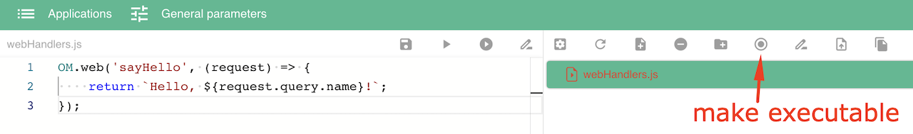
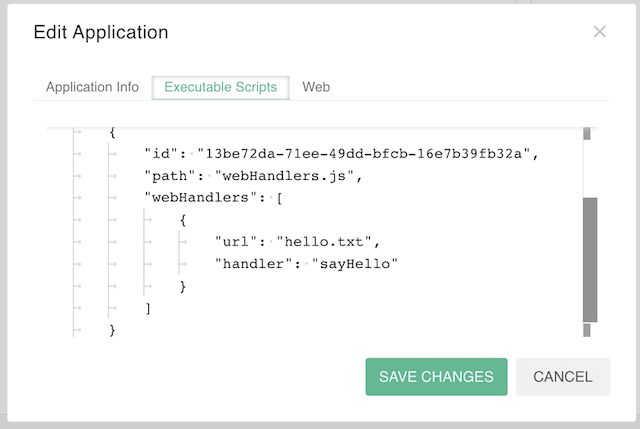
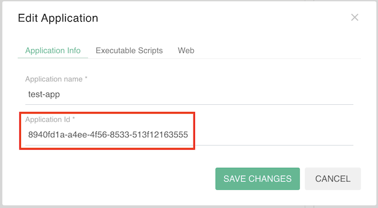
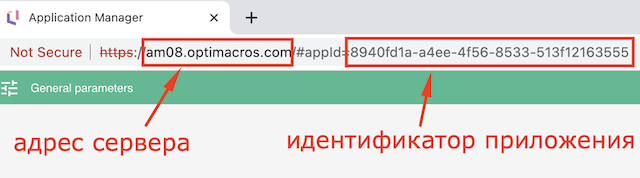
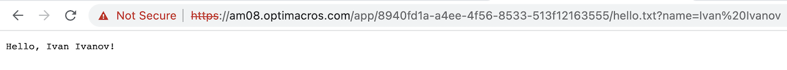
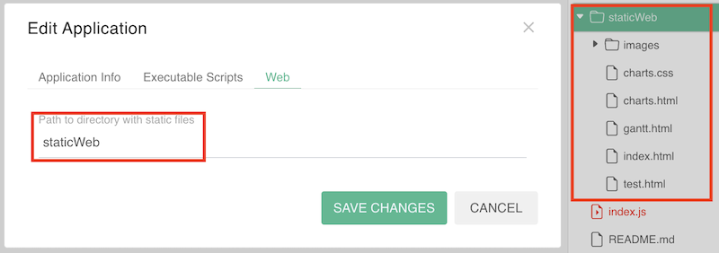

# Веб-интерфейсы<a name="web-handlers"></a>

1. [Создание веб-интерфейсов](#creation)
1. [Асинхронные функции](#async)
1. [Настройка приложения](#settings)
1. [Обращение к веб-интерфейсам](#request)
1. [Статические файлы](#static-files)

&nbsp;

<a name="creation"></a>
## Создание веб-интерфейсов

```js
OM.web(eventName: string, [async] callback: (request: OMWebRequest) => string | WebHandlerResponse): void
```

Создает веб-хендлер с именем `eventName` для взаимодействия с другими приложениями, при обращении к которому будет выполняться функция `callback()`.

***В теле функции `callback()` не работают синхронные функции доступа к данным.*** Для взаимодействия с моделью необходимо пользоваться [`асинхронными функциями`](#async). С этой целью рекомендуется саму функцию `callback()` тоже объявлять асинхронной, хотя это и необязательно.

Входной параметр `request` содержит ссылку на интерфейс `OMWebRequest`.

### Интерфейс OMWebRequest

```ts
interface OMWebRequest {
    method: string,
    headers: { [x: string]: string },
    contentType: string,
    params: {
        appId: string,
        path: string,
    },
    urlRegex?: string[],
    query?: { [x: string]: string },
    body: { [x: string]: string },
}
```

Содержит информацию о запросе, который был передан веб-хендлеру.

- `method` — [`метод HTTP-запроса`](https://ru.wikipedia.org/wiki/HTTP#%D0%9C%D0%B5%D1%82%D0%BE%D0%B4%D1%8B).
- `headers` — [`заголовки HTTP`](https://ru.wikipedia.org/wiki/Список_заголовков_HTTP).
- `contentType` — тип переданного контента [`Content-Type`](https://developer.mozilla.org/ru/docs/Web/HTTP/Headers/Content-Type).
- `params` содержит идентификатор приложения `appId` и URL-путь `path`, по которому был отправлен запрос к веб-хендлеру.
- `urlRegex` — список групп совпадений адреса в регулярном выражении, если оно было задано, иначе это свойство отсутствует.
- `query` — параметры URL.
- `body` — тело запроса.

&nbsp;

Функция-обработчик возвращает ответ в формате строки или ссылку на интерфейс `WebHandlerResponse`. 

### Интерфейс WebHandlerResponse
```ts
interface WebHandlerResponse {
    headers: { [x: string]: string };
    body: string;
}
```

Содержит заголовки `headers` и тело ответа `body` в формате строки.

&nbsp;

В функциях веб-хендлеров нельзя устанавливать соединение с моделью через [`OM.connect()`](./API.md#model-connect), можно только выполнять асинхронную операцию соединения [`OM.connectAsync()`](./API.md#connect-async).

&nbsp;

<a name="async"></a>
## Асинхронные функции

В Application Manager API некоторые функции имеют асинхронные аналоги. Имя асинхронного аналога функции `doSomething()` образовано из её имени и суффикса `'Async'`: `doSomethingAsync()`.

Каждая асинхронная функция принимает те же аргументы, что и её аналог, делает то же самое, что и аналог, и возвращает [`Promise`](https://developer.mozilla.org/ru/docs/Web/JavaScript/Reference/Global_Objects/Promise), возвращающий то же самое значение, что и функция-аналог.

То есть, сигнатуры функций-аналогов выглядят так:

```js
doSomething( [args] ): result
async doSomethingAsync( [args] ): Promise<result>
```

Для вызова асинхронных функций можно использовать функционал класса [`Promise`](https://developer.mozilla.org/ru/docs/Web/JavaScript/Reference/Global_Objects/Promise) или синтаксис [`async/await`](https://learn.javascript.ru/async-await).

&nbsp;

<a name="settings"></a>
## Настройка приложения

В настройках приложения в диалоговом окне `Edit Application` на вкладке `Executable Scripts` для исполняемого скрипта можно добавить список сопоставлений URL и веб-хендлеров, созданных в этом скрипте. Один веб-хендлер может иметь любое количество адресов. При обращении по такому адресу будет происходить вызов функции соответствующего веб-хендлера.

Сопоставления URL и веб-хендлеров задаются списком в свойстве `webHandlers`. Каждое такое сопоставление описывается с помощью следующих свойств:
- `handler` — название веб-хендлера, которое указано при его создании в функции [`OM.web()`](#creation).
- `url` — адрес обращения к веб-хендлеру. 

URL могут быть заданы с помощью [регулярного выражения](https://ru.wikipedia.org/wiki/Регулярные_выражения). В этом случае вместо свойства `url` нужно указать свойство `urlRegex`, значением которого является регулярное выражение.

### Пример

1. Создать веб-хендлер с помощью функции [`OM.web()`](#creation).
2. Сделать скрипт **исполняемым**.



3. Добавить список сопоставлений URL и веб-хендлеров в настройках приложения.



&nbsp;

<a name="request"></a>
## Обращение к веб-интерфейсам

Сторонее приложение может обращаться к веб-интерфейсам с помощью HTTP-запросов. При обращении к ресурсу сначала происходит поиск подходящего веб-хендлера в скриптах приложения. Если он не найден — поиск [статического файла](#static-files) с совпадающим путём.

[`URL`](https://ru.wikipedia.org/wiki/URL) обращения к веб-интерфейсу формируется следующим образом:

`<схема>://<хост>/app/<ID приложения>/<URL—путь>[?<параметры>]`, где
- `<схема>` — схема обращения к ресурсу; в большинстве случаев имеется в виду [сетевой протокол](https://ru.wikipedia.org/wiki/Протокол_передачи_данных),
- `<хост>` — полное доменное имя хоста в системе DNS или IP-адрес хоста, на котором находится система Application Manager,
- `<ID приложения>` — идентификатор приложения,
- `<URL-путь>` — адрес обращения к веб-хендлеру, заданный в настройках приложения,
- `<параметры>` — строка запроса с передаваемыми на сервер (методом GET) параметрами. Начинается с символа `?`, разделитель параметров — символ `&`. Пример: `?параметр_1=значение_1&параметр_2=значение_2&параметр3=значение_3`.

### Пример

1. Формируем URL обращения к веб-хендлеру по примеру выше.
- Система Application Manager находится на сервере по адресу `am08.optimacros.com`.
- Идентификатор приложения можно узнать в диалоговом окне `Edit Application`—>`Application Info`:



...или из адресной строки в браузере:



- Веб-хендлер реагирует на адрес `hello.txt` и принимает входной параметр `name`.

Получаем URL обращения к веб-хендлеру

`https://am08.optimacros.com/app/8940fd1a-a4ee-4f56-8533-513f12163555/hello.txt?name=Ivan%20Ivanov`

2. Отправляем HTTP-запрос из адресной строки в браузере и получаем результат выполнения.



&nbsp;

<a name="static-files"></a>
## Статические файлы

В настройках приложения в диалоговом окне `Edit Application` на вкладке `Web` можно указать папку, все файлы которой будут передаваться стороннему приложению в исходном виде.

### Пример

В приложении есть папка `staticWeb` со статическими файлами.



Например, статический файл `index.html` будет доступен по адресу 

`https://am08.optimacros.com/app/8940fd1a-a4ee-4f56-8533-513f1216355/index.html`

&nbsp;

[API Reference](API.md)

[Оглавление](../README.md)
