# Инструкция программиста для создания приложений на Python 3

Цель данной инструкции - дать подробную информацию об особенностях разработки и запуска приложений на гипервизоре внешних задач Application Manager для программиста.

---

### Список терминов и сокращений, используемых в инструкции
- AM - Application Manager
- HV - гипервизор (диспетчер) внешних задач
- IPC - межпроцессная коммуникация
- Приложение - папка АМ, содержащая набор скриптов
- Скрипт (python) - файл в папке приложения АМ с расширением .py или .py3
- Вэбхендлер - часть URL ресурса, задаваемая настройками приложения АМ
- WS - вэбсокет


## Общая информация

Гипервизор внешних приложений - это программный комплекс, написанный на языке Python 3, созданный для запуска программного обеспечения в заданных условиях окружения с передаваемыми от АМ параметрами.

Application Manager взаимодействует с гипервизором внешних задач по IPC-протоколу, работающему на TCP-сокетах, а также HTTP и WS каналам.

В данной инструкции рассмотрен только запуск и особенности разработки скриптов, написанных на языке Python 3.

## Создание нового приложения в АМ

Экран с приложениями открывается автоматически при начале работы с Application Manager. Или к нему можно перейти, выбрав пункт Applications в верхнем левом меню.

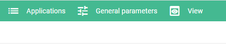

Приложение - это набор файлов (скриптов, статических и др.) в папке. Название папки на данном этапе и является названием приложения.

Создать новое приложение в АМ можно выбрав пункт "Create new application" в контекстном меню, которое открывается по нажатию правой кнопки мыши в области списка приложений.

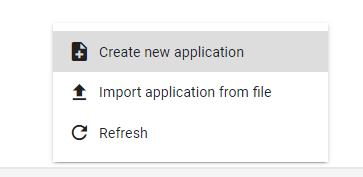

При выборе этого пункта будет открыто модальное окно с формой параметров нового приложения.

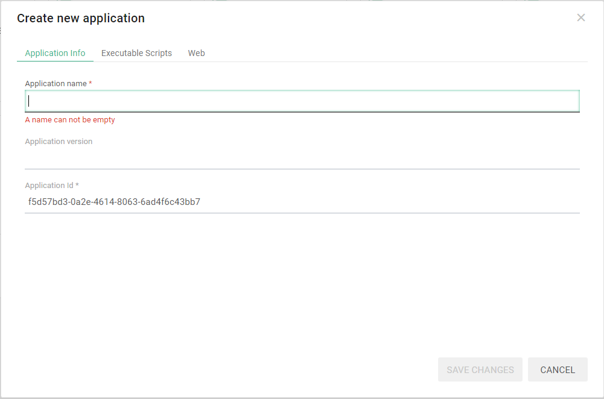

Обязательным параметром в данный момент является только поле имя приложения - Application name *. После его заполнения станет доступна кнопка сохранения изменений "SAVE CHANGES".

Следующее поле - Application id, заполняется АМ автоматически сгенерированным идентификатором. Его мы оставляем как есть.

### Вкладки "Executable Scripts" и "Web"

Закладка "Executable Scripts" содержит информацию об исполняемых скриптах приложения с их наименованиями и постоянными идентификаторами, присваиваемыми им. Идентификаторы исполняемых скриптов могут быть использованы как альтернатива их именам в различных ситуациях в коде, которые будут описаны далее.

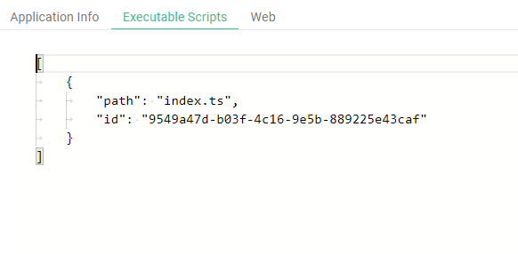

При создании нового приложения разработчики АМ решили автоматически создавать пустой исполняемый скрипт на языке TypeScript. Можно удалить его после создания приложения, если не будете работать с ним.

Вкладка "Web" содержит форму для настройки параметров работы Application Manager в качестве вэбсервера.

Application Manager работает также и в качестве вэб-сервера для вашего приложения. Он может автоматически отдавать статические файлы, которые вы создаете в своем приложении, а также обрабатывать http/https-запросы, поступающие на задаваемые вами адреса или запускать необходимые скрипты обработки этих запросов - этот механизм называется вэбхендлеры.

Каждое приложение АМ имеет автоматически формируемый адрес:

https://Адрес-АМ/app/ИдентификаторПриложения/ИмяСтатическогоФайлаИлиВэбХэндлер

В поле "Path to directory with static files" указывается папка, в которой вы будете размещать статические html и др. файлы. Лучше создавать такую папку в приложении для улучшения его структуры.
Если вы не хотите создавать отдельную папку для статических файлов, необходимо указать в этом поле '/' и тогда АМ будет искать их в корне приложения.

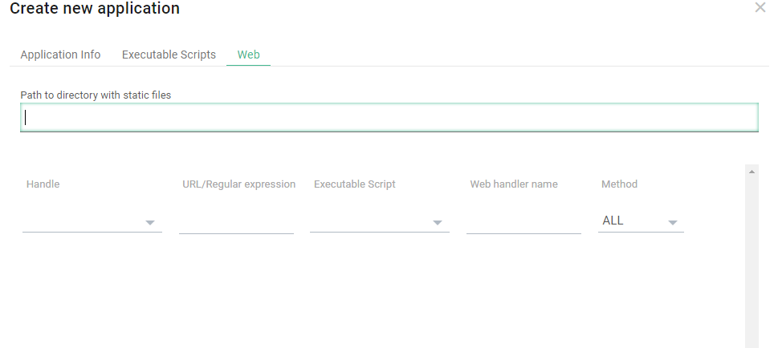

Далее идет список вэб-хендлеров.

Пока этот функционал ограничен при работе со скриптами, исполняемыми гипервизором, но его можно использовать для запуска скриптов при обращении на заданный в вэбхенлдере http-запрос на заданный URL. АМ, получив запрос на этот вэбхендлер, запустит заданный скрипт, если он еще не запущен.  

Как было упомянуто выше, для создания приложения в АМ достаточно только заполнить поле с именем приложения. 

Заполнив, для примера это поле значением App1
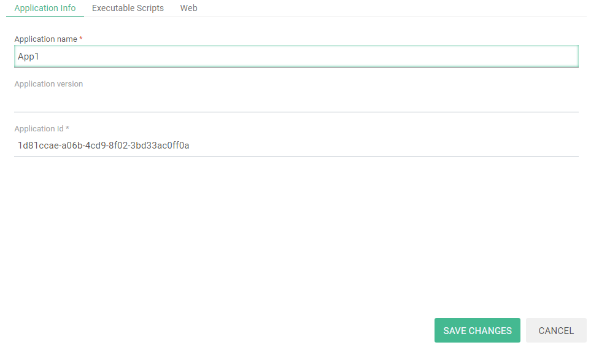
и нажав кнопку "SAVE CHANGES" вы увидите в списке приложений папку с этим именем:

 (и, возможно, фоновым рисунком, пока случайным)

Нажав на папку, можно попасть в среду разработки приложения Application Manager.

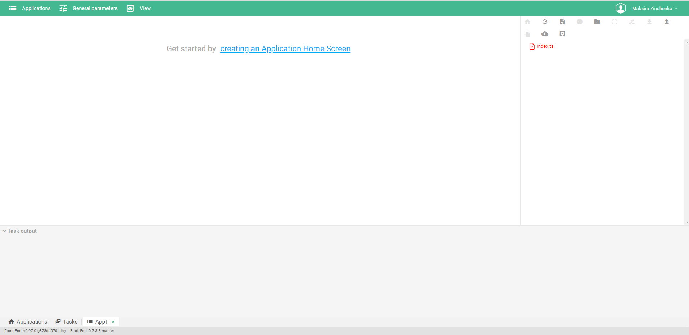

Верхнее меню служит для перехода к окну выбора приложений, установке глобальных параметров приложения, выбора темы и т.д.

Слева располагается основное окно редактора скриптов.

Справа располагается список файлов и папок приложения, меню для их создания, загрузки, обновления списка и т.д.

При выборе файла также появляются дополнительные опции меню (Запуск скрипта, Запуск скрипта с параметрами и т.д.) и активируются неактивные ранее:


В нижней части среды находится область вывода консоли скриптов:

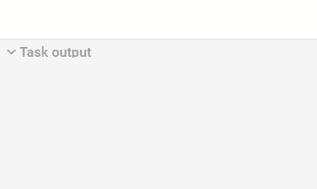

А также меню быстрого перехода между окрытыми приложениями и статусная строка с текущими версиями фронтенда и бэкенда Application Manager (может понадобится при обращении к разработчикам АМ):

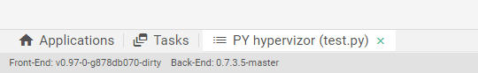

Механизм манипулирования скриптами на Python ничем не отличается от скриптов на языках JavaScript и TypeScript и любыми другими скриптами. 

Можно ознакомиться с ним в основном руководстве по Application Manager.

Для запуска скриптов можно использовать кнопки запуска без параметров (с пустым словарем параметров) и с параметрами, задаваемыми при старте. 

Запуск скриптов Python через механизм вэб-хэндлеров возможен, но обработка самих запросов скриптами пока не предусмотрена.

## Быстрый старт

В панели файлов приложения создайте новый скрипт:


Назовем его test.py


В списке файлов приложения у вас появится новый файл test.py, при его выборе слева можно редактировать его содержимое.

Для сохранения изменений кода скрипта используется кнопка:


которая активируется при изменениях, либо используется сочетание клавиш Ctrl-S.

Чтобы АМ понимал, что это исполняемый скрипт, необходимо выделить его в списке и нажать кнопку Make executable:

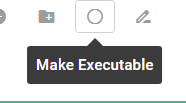

Если скрипт не будет помечен, как исполняемый, его невозможно будет запустить напрямую из панели АМ или назначить в вэб-хэндлере. Также, невозможно вызвать его на исполнение как дочернюю задачу.

Добавим в наш скрипт знаменитое Hello world! и сохраним изменения:


Проверим, как исполняется наш скрипт. Запустите его кнопкой запуска без параметров.

Код скрипта выполнится, в консоли АМ появится результат работы (вывод на стандартный поток вывод из скрипта выводится в консоль АМ. При обычной печати инструкцией print - вывод производится в стандартный поток вывода):

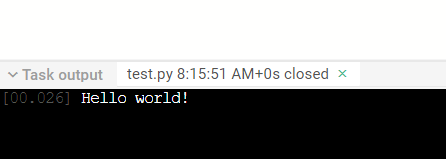

В консоли Application Manager появляется заклада с именем скрипта, выводившего информацию на печать в консоль, время его запуска, состояние (closed - при завершении или иное). В окне консоли видно, что скрипт вывел информацию на печать спустя 0.026 секунд после старта задачи.

В правой области консоли показывается информационная панель задачи:

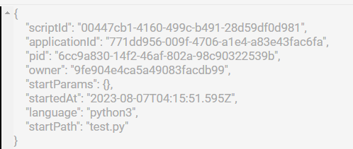

**Внимание!** Информация из этой панели не передается задаче. Можно получить лишь часть информации, передаваемой задаче из AM при запуске.


## Особенности запуска скриптов в АМ

При ручном старте скрипта из панели АМ при каждом запуске будет запускаться отдельный процесс выполнения кода этого скрипта - **задача** (технически, перед запуском самой задачи запускается сначала процесс-наблюдатель - observer, но это скрыто от пользователя).

Т.о., если запустить скрипт 5 раз через панель запуска АМ, то для каждого клика запуска запустится отдельная задача в контейнере гипервизора.

Можно передать запускаемой задаче параметры в виде json-объекта, используя кнопку запуска задачи с параметрами. В этот объект параметров также будут добавлены глобальные параметры, если они были установлены (через верхнее меню General Parameters).

С текущими настройками по умолчанию каждая задача имеет таймаут выполнения 300 секунд  (задается переменной окружения DEFAULT_TASK_TIMEOUT_SEC). Этот таймаут можно изменить, задав его при запуске в виде параметра "timeout" и указав количество секунд. Если указать значение меньше 0 (например, -1) то гипервизор не будет ограничивать задачу по времени ее выполнения.

Кроме того, с текущими настройками по умолчанию процесс задачи не может занимать в памяти более 100 Мб (устанавливается переменной окружения DEFAULT_TASK_MAX_MEMORY_MB). Можно тоже изменить это ограничение для конкретного скрипта при запуске с параметром "memoryLimit" и указав количество мегабайт.


## Рабочее окружение скриптов

Гипервизор работает с контейнере Docker, отдельном от АМ.

Каждая задача запускается в отдельном процессе.

Взаимодействие задач друг с другом, если они запускаются на одном гипервизоре никак не ограничивается. 

### Файловая система

Программист имеет доступ к папкам операционной системы контейнера гипервизора. Однако, любые изменения файловой системы контейнера не будут сохранены при перезапуске контейнера.

К контейнеру гипервизора также подключено несколько томов-папок (volumes), правила доступа к которым ограничены на уровне скрипта инициализации контейнера.

**/sources** - папка с файлами приложений Application Manager. Подключена в режиме только для чтения. (Если администратор даст к этой папке и доступ на запись, то интерпретатор Python сможет автоматически создавать файлы .pyc со скомпилированным байт-кодом, которые при будут запускаться быстрее при повторных запусках)

**/workdirs** - папка рабочих директорий задач. При старте каждой задачи для нее создается отдельная папка, где в качестве имени папки используется идентификационный номер задачи - pid. Можно хранить в этой папке собственные данные, необходимые при рассчетах и т.д. Эти файлы не стираются автоматически при перезапусках контейнера гипервизора. Также можно получить данные и из папок других задач, если знать их pid, но это не всегда удобно или вообще возможно при работе.

**/venvs** - папка виртуальных окружений. Подробности работы с виртуальными окружениями будут описаны ниже в соответствующем разделе. Это просто папка с доступом на чтение и запись, в которой гипервизор создает и хранит виртуальные окружения Python.

**/certs** - папка серфтификатов, необходимых для запуска сервисов, обслуживающих безопасные запросы на уровне доменного имени Application Manager. Доступ к этой папке есть только для чтения.

### Сетевое окружение

Можно запускать внутри контейнера любое количество серверов, обслуживающих только внутренний локальный сетевой интерфейс контейнера (127.0.0.1) на любых доступных портах. Таким образом, можно использовать любой доступный инструментарий языка Python 3 для работы с сетью, но пока только внутри контейнера. Также можно взаимодействовать с Apllication Manager, если знаете его архитектуру и создавать собственные модули и скрипты с собственным API. 

Можно выполнять запросы к сетевым ресурсам - сайтам и серверам. Однако никто из внешней сети пока не может получить доступ к серверу, написанному в виде скрипта и запущенному на гипервизоре.


## Особенности работы со скриптами на Python

### Виртуальные окружения

Задачи обычно исполняются в каком то "виртуальном окружении", в котором уже присутствует набор стандартных пакетов Python 3.

Для удобства, в системе гипервизора для виртуальных окружений введено понятие "имя окружения" - просто строка - название папки в томе виртуальных окружений /venvs.

При старте контейнера гипервизор создает одно общее виртуальное окружение (под именем default, оно задается через переменную окружения DEFAULT_VENV_NAME), в котором по умолчанию будут запускаться все задачи на Python, исполняемые на данном гипервизоре. 

Это поведение можно задать переменными окружения (устанавливается администратором):

USE_VENV - переменная, указывающая гипервизору необходимость использования механизма отдельного виртуального окружения для задач. Может иметь значения True или False. По умолчанию, имеет значение True. Сам гипервизор также написан на Python. Механизм отдельных виртуальных окружений позволяет использовать гипервизору и задачам разные наборы дополнительных пакетов, чтобы не было сбоев и конфликтов.

DEFAULT_VENV_CLEAR_START - эта переменная указывает гипервизору, нужно ли ему принудительно пересоздавать общее виртуальное окружение задач при перезапуске контейнера гипервизора (и вообще AM). По умолчанию имеет значение True. Это значит, что если доустановить в общее окружение какие то дополнительные пакеты (будет рассмотрено позже), они исчезнут при перезапуске гипервизора. Значение False позволяет гипервизору запускаться немного быстрее, так как он не создает окружение заново, если оно уже существует. Если окружения вообще еще не было создано, оно все равно будет создано при первом запуске даже при значении False.

Есть еще несколько переменных окружения, влияющих на настройку режима работы виртуальных окружений:

VENVS_DIR - папка хранения виртуальных окружений. Указывает на внешний том, подключенный к контейнеру.
VENV_CREATION_TIMEOUT - таймаут времени создания виртуального окружения. При превышении в коде сработает исключение и задача не будет запущена. По умолчанию имеет значение 300 секунд.
VENV_WAIT_INTERVAL - интервал между попытками создания виртуального окружения. По умолчанию имеет значение 1 секунду.

### Общее виртуальное окружение "default"

Гипервизор запускает все задачи в общем виртуальном окружении с именем "default". При старте контейнера в это общее окружение автоматически доустанавливаются пакеты, указанные в файле requirements.txt, которые использует и сам гипервизор для своей работы.

Вот список этих пакетов и их версий, которые можно просто импортировать и использовать при необходимости:

- aiohttp==3.8.4
- aiojobs==1.1.0
- aiosignal==1.3.1
- async-timeout==4.0.2
- asyncio==3.4.3
- attrs==23.1.0
- charset-normalizer==3.1.0
- frozenlist==1.3.3
- idna==3.4
- lxml==4.9.3
- multidict==6.0.4
- procbridge==1.2.2
- psutil==5.9.5
- pytils==0.4.1
- selectors==0.0.14
- six==1.16.0
- user-agent==0.1.10
- weblib==0.1.30
- yarl==1.9.2

### Запуск задачи в выделенном виртуальном окружении

Часто скрипты приложения могут требовать разные версии пакетов, несовместимые друг с другом. Или не хочется замусоривать одно общее виртуальное окружение всеми возможными пакетами, которые используются всеми скриптами всех приложений.

Для этого в гипервизор был добавлен механизм выделенных виртуальных окружений. Можно создавать выделенное окружение, доустанавливать в него нужные пакеты нужных версий и запускать задачу именно в нем отдельно от общего окружения "default".

Есть два варианта создания или указания для гипервизора - в каком виртуальном окружении запустить задачу.

#### 1. Выбор/создание выделенного виртуального окружения через параметры запуска задачи

Для виртуальных окружений используется имя - строка (подходящая под именование папки в файловой системе в папке хранения виртуальных окружений). 

Если в стартовых параметрах задачи в АМ указать параметр "venv_name" и строковым значением с именем окружения, то перед стартом задачи гипервизор попытается найти такое окружение в папки окружений (/venvs). 

Если такого окружения еще нет, гипервизор автоматически создаст его, но не будет ничего доустанавливать в него, как в случае с общим окружением задач. А затем запустит заданную задачу уже в этом пустом окружении.

Есть еще один опциональный параметр запуска, который может быть полезен при манипуляциях выделенными окружениями - "clean_venv". Он указывает гипервизору удалить среду после завершения задачи, если это не общая среда окружения задач "default". При указании его в параметрах при ручном запуске через АМ используйте значение для этого параметра true или false. При указании его в параметрах в коде Python при запуске дочерней задачи используйте True или False соответственно.

Если вы запускаете одновременно или так получается, что несколько задач используют одно выделенное виртуальное окружение в одно время и заданы параметры автоматического удаления этого окружения, то гипервизор удалит окружение только после завершения последней задачи. 

Необходимо брать в рассчет, что создание нового виртуального окружения может занимать определенное время. Еще больше времени может занимать доустановка в него нужных пакетов. Планируйте процессы использования создания и удаления (при необходимости) виртуальных окружений так, чтобы этот процесс не тратил ресурсы времени впустую. 

** Внимание! Возможно вручную задать для выполнения задачи и общую среду окружения default, это никак не ограничено. Но делать это не рекомендуется! Лучше использовать для своих задач отдельные виртуальные окружения, если планируете доустанавливать дополнительные пакеты при разработке. Это упростит разработку и поддержку в дальнейшем. **

**Примеры:**

Запустить задачу в выделенном виртуальном окружении venv1. Если его еще нет, будет создано пустое. Если уже существует - оно будет использовано.


Запустить задачу в выделенном (создать его) виртуальном окружении venv1 и удалить его после завершения задачи:

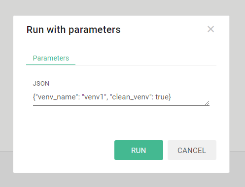

#### 2. Программный выбор/создание выделенного виртуального окружения

В гипервизоре реализован простой API для манипулирования виртуальными окружениями задач. 

Можно импортировать в скрипт специальный класс из модуля для манипулирования виртуальными окружениями appvenv:

```py
from ompy.appmanager.appvenv import Venv
```

Здесь ompy - пакет API для скриптов пользователя
appmanager - пакет модулей управления приложением
appvenv - модуль управления виртуальными окружениями приложений.

Venv это класс, с помощью которого можно создавать и удалять виртуальные окружения, доустанавливать внешние пакеты. Также класс имеет некоторые полезные утилиты в виде методов класса.

После импорта класса вы можете использовать его как для создания нового окружения, так и "привязки" к существующему уже окружению при инициализации.

Примеры кода:
```py
from ompy.appmanager.appvenv import Venv

# создать новое окружение или связать с переменной v виртуальное окружение venv1
v = Venv('venv1')

# вывести список пакетов, установленных в виртуальном окружении venv1
print(v.list())
# вывести список пакетов и их версий, установленных в виртуальном окружении venv1
print(v.list_spec())

# вывести значение переменной окружения USE_VENV
print(f'USE_VENV env variable: {Venv.get_env_value("USE_VENV")}')

# проверить на валидность имени для окружения значение ///
print(f'Is /// valid venv name?: {Venv.is_valid_venv_name("///")}')

# вывести список доступных виртуальных окружений
print(f'List of available venvs: {Venv.get_venvs()}')

# Удалить виртуальное окружение с помощью метода класса. После этого переменную v использовать нельзя или необходимо переинициализировать!
Venv.delete_venv('venv1')

# вывести список доступных виртуальных окружений
print(f'List of available venvs: {Venv.get_venvs()}')
```

Так это работает на текущий момент:

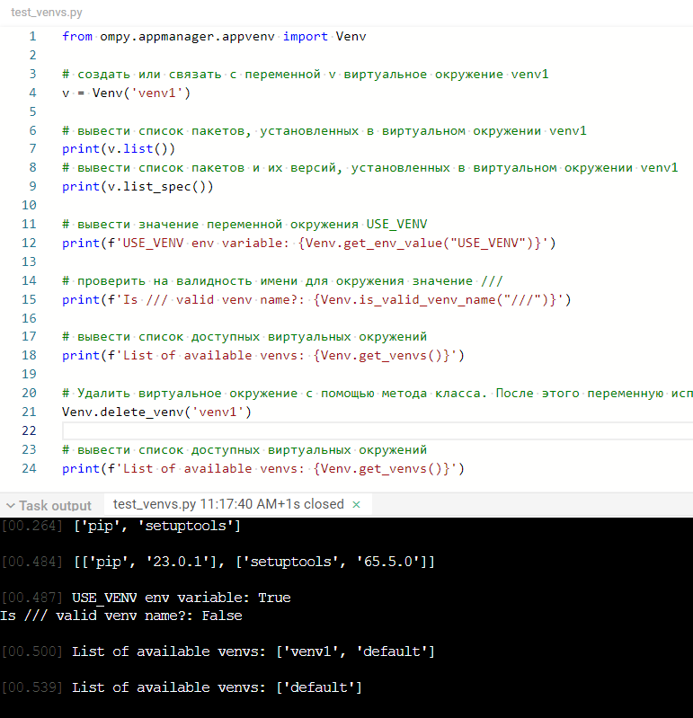

## Работа с локальными пакетами и модулями

### Импорт локальных модулей и пакетов

В приложении АМ есть возможность создавать как файлы, так и папки. 

Таким образом, можно использовать функционал импорта из модулей или пакетов, обычно используемых в Python.

Например, создадим такую структуру файлов и папок в приложении:

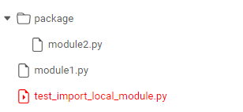

У нас есть стартовый исполняемый файл test_import_local_module.py и два модуля, один из которых в пакете package со следующим содержимым:

Код test_import_local_module.py:

```py
from module1 import module1_print
from package.module2 import module2_print

print('Test local module imports')

module1_print()
module2_print()
```

Код module1.py:

```py
print('Imported module 1')

def module1_print():
    print('Print from module 1')
```

Код module2.py:

```py
print('Imported module 2')

def module2_print():
    print('Print from module 2')
```

Результат работы скрипта будет:

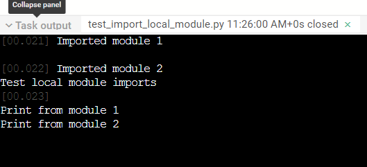

Возможно также использовние функционала __init__.py файлов при необходимости.

## Установка дополнительных внешних пакетов

Очень часто при создании приложений на Python еобходимо доустанавливать какие то внешние пакеты других разработчиков.

В обычном случае на локальной машине чаще всего это делается с помощью приложения модуля pip. Но в АМ у программиста нет прямого доступа к консоли контейнера.

Возможно запускать эту команду программно, используя стандартный модуль subprocess, но это не очень удобно, либо придется написать какой то удобный функционал самому.

В классе Venv, находящемся в модуле ompy.appmanager.appvenv, который уже использовали в разделе управления виртуальными окружениями реализован набор методов, упрощающих работу с установкой пакетов в привязанном виртуальном окружении обьекта. Также в этом классе есть набор статических методов класса, с помощью которых можно манипулировать установкой.

Пример установки пакета requests (скрипт test_venv_package_install.py):

```py
from ompy.appmanager.appvenv import Venv

# создаем новое или используем какое то существующее виртуальное окружение some_venv
v = Venv('some_venv')

# выводим список пакетов, уже установленных в этом окружении на печать
print(v.list())

# установим пакет requests в это окружение
v.install_latest('requests')

# проверим, что установка пакета requests и его зависимостей прошла успешно
print(v.list_spec())

v.install('requests', spec='==2.1')

# проверим версии пакетов
print(v.list_spec())
```

Метод install_latest установит самый свежий вариант пакета. 

Метод install без указания спецификатора установит свежую или не будет устанавливать пакет, если любая его версия уже есть в окружении. Указав опциональный параметр spec, вы можете установить нужную вам версию пакета. Формат спецификатора такой же как и при использовании pip напрямую через консоль.

Если в процессе установки произойдет ошибка, будет выброшено исключение. В этом коде мы рассматриваем идеальный случай, эта ситуация не обрабатывается.

Методов удаления пакетов из виртуального окружения в классе пока нет. Если устанавливается версия пакета, несовпадающую с уже установленной, pip сам должен удалить другую версию пакета. Все как и при использовании обычного pip.

# Запуск дочерних задач

В AM предусмотрен функционал, когда одна задача может запустить другую задачу.

Этот механизм использует термины "родительская" - запускающая задача и "дочерняя" - задача, запускаемая из родительской.

Родительская задача посылает АМ специальный IPC-пакет для запуска дочерней задачи и уже АМ запускает эту задачу, как дочернюю, передавая ей также соответствующие параметры.

Это позволяет запускать из одной задачи какой то связанный или совершенно независимый функционал другого скрипта.

Можно придумать множество примеров использования такого механизма.

Самый простой случай - создание каких то загрузчиков. Например, родительская задача может подготовить нужное виртуальное окружение, установить в него необходимые версии пакетов, а затем - запустить уже дочернюю задачу, которая может работать в окружении с этой подготовленной средой.

Также можно создавать загрузчики, которые и не запускают дочерние задачи, а работают независимо, подготавливая нужную среду для других задач. Механизм дочерних задач просто хорошо вписывается в этот рабочий процесс, так как обычно не рекомендуется устанавливать новые пакеты и работать с ними в одном скрипте-задаче (но это возможно, просто инструкции импорта должны следовать после установки пакетов), а дочерняя задача запускается как отдельный новый процесс и позволяет сделать нам "чистый" запуск с уже установленными пакетами.

Для запуска дочерней задачи нам нужно знать идентификатор скрипта или его имя. Вот простой пример запуска дочерней задачи (child.py) из родительской задачи (parent.py):

Код дочернего скрипта child.py:

```py
print('Print from child')
```

Код родительского скрипта parent.py:

```py
from ompy.appmanager.communication import run_am_script

script_id = 'child.py'
script_params = {}
print(f'Запуск дочерней задачи из скрипта {script_id} '
      f'с параметрами {script_params}')
child_pid = run_am_script(script_id, script_params)

print(child_pid)

print('Завершение родительской задачи')
```

Результат запуска скрипта parent.py в консоли АМ:


Можно заметить, что при запуске дочерней задачи, run_am_script возвращает pid задачи дочернего процесса.

Дочерняя задача может продолжать работу даже после завершения родительской.

**Важно! Дочерняя задача также должна быть помечена, как исполняемая для успешного запуска! Это поведение отличается от импорта локальных модулей, которые могут не быть помечены как исполняемые, так как импорт осуществляет процесс одного интерпретатора одной задачи.**

Механизм запуска дочерних задач в данный момент реализован в виде простой функции модуля ompy.appmanager.communication.


### Обмен данными между задачами

Как было сказано ранее в разделах о файловой системе и сетевом окружении - возможно создавать собственные механизмы обмена данными между задачами или сервисами. Можно даже скрипты с помощью стандарного модуля subprocess как без уведомления Application Manager, это никак не ограничивается в гипервизоре внешних задач.

Представим, что у есть скрипт или программа, которую нужно запустить с входными параметрами и получить ее вывод из стандартного потока при завершении. В нашем случае - будем использовать скрипт, который получает параметр рассчета факториала из входного аргумента и возвращает результат, распечатав его.

Пример такого простого скрипта (test_sub.py):

```py
import sys
import math

number = int(sys.argv[1])
result = math.factorial(number)
print(result)
```
Нет необходимости даже делать этот файл исполняемым в AM.

Пример основной задачи, которая запускает test_sub.py и получает результат (test_run_sub.py):

```py
import subprocess
import os
from ompy.appmanager.variables import TASK_PARAMS

def calculate_factorial(number):
    command = ['python', os.path.join(TASK_PARAMS['applicationPath'], 'test_sub.py'), str(number)]
    result = subprocess.check_output(command).decode('utf-8').strip()
    return int(result)


input_number = 5
factorial_result = calculate_factorial(input_number)
print(f'Factorial of {input_number} is: {factorial_result}')
```

Здесь использована переменная TASK_PARAMS['applicationPath'], чтобы получить путь к папке с исходными файлами приложения. Затем был запущен скрипт test_sub.py с помощью модуля subprocess и извлечен результат из его вывода консоли.

Такой код будет работать очень быстро. Все эти процессы будут работать внутри контейнера гипервизора и не "вырвутся" из него.

Также, можно привести пример вэбсокет-сервера и клиента, которые работают внутри контейнера гипервизора.

Перед запуском примеров создадим выделенное окружение, которое будут использовать наши скрипты:

Скрипт создания виртуального окружения и установки пакета websockets (local_websocket_venv_builder.py):

```py
from ompy.appmanager.appvenv import Venv

v = Venv('websockets_venv')
v.install('websockets')
print(v.list())
```

Код вэбсокет-сервера (local_websocket_echo_server.py):

```py
# !!! RUN IT WITH PARAMS {"venv_name":"websockets_venv","timeout":-1} or make parent loader script in venv !!!

import asyncio
import ssl
import websockets

async def echo(websocket, path, stop_event):
    try:
        async for message in websocket:
            print(f'Получено сообщение: {message}')
            await websocket.send(message)

            if message == 'stop':
                print('Получен сигнал остановки сервера')
                # await websocket.send("Server is stopping...")
                stop_event.set()
                break

            while not stop_event.is_set():
                # Send 'keep' message to the client every second
                await websocket.send('keep')
                await asyncio.sleep(1)
    except websockets.ConnectionClosed:
        print('Соединение закрыто')

async def start_server():
    ssl_context = ssl.SSLContext(ssl.PROTOCOL_TLS_SERVER)
    ssl_context.load_cert_chain('/certs/bundle.crt', '/certs/crt.key')
    
    stop_event = asyncio.Event()

    async with websockets.serve(lambda ws, path: echo(ws, path, stop_event), '0.0.0.0', 18565, ssl=ssl_context) as server:
        print('Сервер запущен. Ожидание подключений...')

        await stop_event.wait()  # Wait until the stop event is set
        print('Сервер завершает работу.')

if __name__ == '__main__':
    asyncio.run(start_server())

```

Пример вэбсокет-клиента (local_websocket_echo_client.py):

```py
# !!! RUN IT WITH PARAMS {'venv_name':'websockets_venv'} or make parent loader script in venv!!!

import asyncio
import ssl
import websockets

async def main():
    uri = 'wss://0.0.0.0:18565'
    ssl_context = ssl.SSLContext(ssl.PROTOCOL_TLS_CLIENT)
    ssl_context.check_hostname = False
    ssl_context.verify_mode = ssl.CERT_NONE
    try:
        async with websockets.connect(uri, ssl=ssl_context) as websocket:
            print('Send request...')
            message = 'stop'
            await websocket.send(message)
            print(f'Сообщение {message} отправлено')
            if message != 'stop':
                response = await websocket.recv()
                print(f'Received response: {response}')
    except Exception as e:
        print(f'Ошибка соединения: {e}')

if __name__ == '__main__':
    asyncio.run(main())
```

Можно запускать сервер и клиент вручную с нужным параметром виртуального окружения, либо использовать отдельный скрипт запуска сервера (local_start_ws_server_in_venv.py):

```py
from ompy.appmanager.communication import run_am_script

script_id = 'local_websocket_echo_server.py'
script_params = {'venv_name':'websockets_venv','timeout':-1}
child_pid = run_am_script(script_id, script_params)
print(f'WS server runs with {child_pid} pid')
```

и клиента (local_start_ws_client_in_venv.py):

```py
from ompy.appmanager.communication import run_am_script

script_id = 'local_websocket_echo_client.py'
script_params = {'venv_name':'websockets_venv'}
child_pid = run_am_script(script_id, script_params)
print(f'WS server runs with {child_pid} pid')
```

Архитектурно в AM закладываются методы обмена задач данными друг с другом через AM. Этот функционал пока не реализован для внешних задач в виде какого либо API.

На текущий момент в гипервизоре есть реализованный функционал в виде простого API, позволяющий обмениваться данными только между задачами, исполняемыми на гипервизоре. Можно обмениваться данными с задачей, зная ее pid-идентификатор, а в случае с дочерними задачами - мы получаем его при запуске из родительской задачи. 

В будущем возможна реализация обмена данными между задачами любого языка через механизм вэбсокетов Application Manager.

Взаимодействие между задачами реализовано через "мост" данных вэбсокет-сокет. При старте задачи гипервизор ожидает запрос вэбсокет-соединения по адресу 0.0.0.0:RESOURCE_SERVER_LOCAL_PORT/pid
где RESOURCE_SERVER_LOCAL_PORT - порт локального вэбсокет сервера гипервизора, значение которого на текущий момент 18564 - установлено в переменной окружения, а pid - идентификатор задачи, который вы можете получить из параметров запуска. 

Одна задача может подключиться к вэбсокет адресу другой задачи и отправить в него данные. Эти данные будут переданы гипервизором в unix-сокет задачи с этим pid. В свою очередь, задача может ожидать такое подключение на своем сокете и принимать данные по нему от другой задачи.

С помощью этого функционала задачи могут обмениваться друг с другом данными в бинарном или текстовом виде.

### Пример взаимодействия между задачами через вэбсокет-сокет задачи

Допустим, у нас есть задача, рассчитывающая факториал числа, который она получает из своих параметров запуска, передаваемых ей от Application Manager.

Для работы с параметрами, которые получают задачи, а также для получения информации о переменных окружения в API гипервизора реализован модуль ompy.appmanager.variables из которого вы можете получить множество полезных значений, среди которых есть и TASK_PARAMS - словарь со значениями параметров, передаваемых задаче. Пример этого словаря при запуске задачи без дополнительных параметров (запуск задачи из панели управления кнопкой Run Script):

{'pid': '94edcac2-3529-4699-8468-d3a0c00696c2', 'parentPid': None, 'applicationPath': '/sources/Manual-N9IBvh', 'scriptPath': 'test_data_exchange_parent.py', 'scriptParams': {}, 'outputPath': '/workdirs/94edcac2-3529-4699-8468-d3a0c00696c2'}

По умолчанию все задачи получают в этом словаре данные о своем идентификаторе pid, родительском идентификаторе - parentPid, если эта задача запущена как дочерняя, путь к папке с исходными файлами кода скрипта приложения в контейнере - applicationPath, путь к скрипту - scriptPath, параметры, передаваемые скрипту пользователем при ручном запуске или программном запуске как параметры задачи - scriptParams, а также рабочая директория задачи - outputPath.

Если мы хотим получать параметр из пользовательских параметров задачи, нам надо получать его из словаря scriptParams.

Пример взаимодействия задач через каналы вэб-сокеты-сокет, управляемые гипервизором.

Пример дочерней задачи (test_data_exchange_child.py):

```py
import asyncio, aiohttp
import math
from ompy.appmanager.variables import TASK_PARAMS


async def main():
    factorial_param = TASK_PARAMS['scriptParams'].get('factorial', None)

    if not factorial_param is None:
        print(f'Рассчет факториала числа {factorial_param} в дочерней задаче')
        if not TASK_PARAMS['parentPid'] is None:
            print(f'PID родительской задачи: {TASK_PARAMS['parentPid']}')
            WS_URL = f'http://127.0.0.1:18564/{TASK_PARAMS['parentPid']}'
            print(f'Адрес вэбсокета сокета родительской задачи: {WS_URL}')
            async with aiohttp.ClientSession() as session:
                async with session.ws_connect(WS_URL) as ws:
                    result = math.factorial(factorial_param)
                    await ws.send_str(f'result is {result}')
                    print(f'Результат рассчета факториала {result} отправлен родительской в вэбсокет->сокет задаче')


asyncio.run(main())
```

Пример родительской задачи, запускающей дочернюю и ожидающий от нее результат:

```py
from ompy.appmanager.communication import run_am_script, wait_for_socket_from_web
from ompy.appmanager.observer import read_json_from_observer

script_id = 'test_data_exchange_child.py'
script_params = {'factorial': 5}
print(f'Запуск дочерней задачи рассчета факториала из скрипта {script_id}'
      f' с параметрами {script_params}')
child_pid = run_am_script(script_id, script_params)

print('Ожидаем результат от дочерней задачи')
soc = wait_for_socket_from_web()
message = soc.sync_read_text_message()
print(f'Получен результат из дочерней задачи: {message}')
soc.sync_close()

print('Завершение родительской задачи')
```

Родительская задача запускает дочернюю с параметром {'factorial': 5}, а затем ожидает подключения "к себе" по вэбсокету. Функция wait_for_socket_from_web возвращает экземпляр сокета, из которого могут быть получены данные с помощью синхронного метода sync_read_text_message.