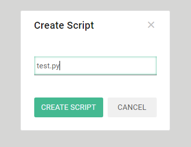
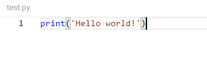
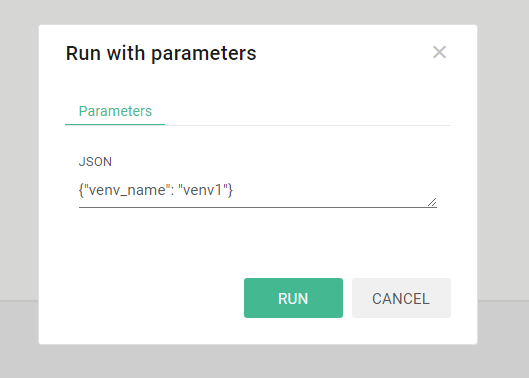
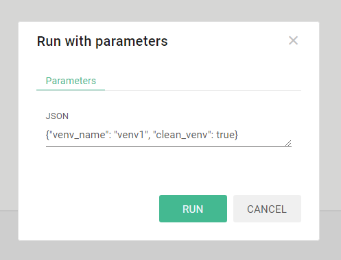
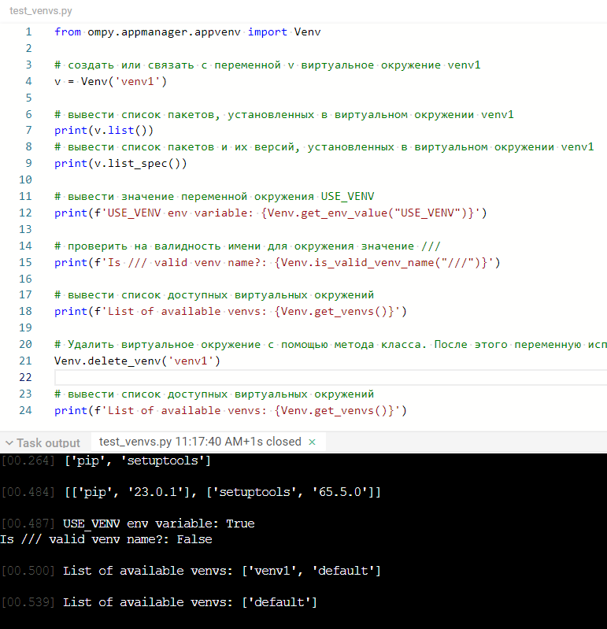
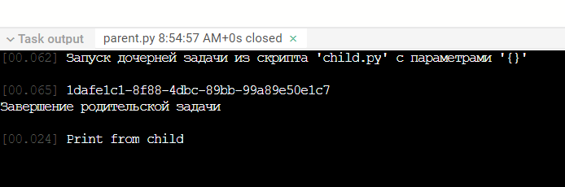

# Инструкция по созданию приложений на Python 3

Цель инструкции: дать подробную информацию об особенностях разработки и запуска приложений на гипервизоре внешних задач Application Manager для программиста.

---

### Список терминов и сокращений, используемых в инструкции
* HV — [`гипервизор`](https://ru.wikipedia.org/wiki/Гипервизор) (диспетчер) внешних задач
* IPC — [`межпроцессная коммуникация`](https://ru.wikipedia.org/wiki/Межпроцессное_взаимодействие)
* Скрипт (python) — файл в папке приложения АМ с расширением `.py` или `.py3`
* Веб-хендлер — часть URL ресурса, задаваемая настройками приложения АМ
* WS — [`веб-сокет`](https://ru.wikipedia.org/wiki/WebSocket).

&nbsp;

## Общая информация

Гипервизор внешних приложений — это программный комплекс, написанный на языке Python 3, созданный для запуска программного обеспечения в заданных условиях окружения с передаваемыми от АМ параметрами.

Application Manager взаимодействует с гипервизором внешних задач по протоколу IPC, работающему на TCP-сокетах, а также по каналам HTTP и WS.

Здесь рассмотрен только запуск и особенности разработки скриптов, написанных на языке Python 3.

&nbsp;

## Быстрый старт

В панели файлов приложения создадим новый скрипт:


Назовём его `test.py`:



Если скрипт не будет помечен, как исполняемый, его невозможно будет запустить напрямую из панели АМ или назначить в веб-хендлере. Также невозможно вызвать его на исполнение как дочернюю задачу. Поэтому нужно выделить его в списке и нажать кнопку `Make executable`:


Для сохранения изменений кода скрипта используется кнопка


которая активируется при изменениях, либо сочетание клавиш `Ctrl+S`.

Добавим в наш скрипт знаменитое `Hello world!` и сохраним изменения:



Проверим, как исполняется наш скрипт. Запустим его кнопкой запуска без параметров.

Код скрипта выполнится, в консоли АМ появится результат работы:


В консоли Application Manager появляется вкладка с именем скрипта, выводившего информацию на печать в консоль, время его запуска, состояние (`closed` при завершении или иное). В окне консоли видно, что скрипт вывел информацию на печать спустя `0.026` секунд после старта задачи.

В правой области консоли показывается информационная панель задачи:


**Внимание!** Информация из этой панели не передаётся задаче. Можно получить лишь часть информации, передаваемой задаче из AM при запуске.

&nbsp;

## Особенности запуска скриптов в АМ

При ручном старте скрипта из панели АМ при каждом запуске будет запускаться отдельный процесс выполнения кода этого скрипта — **задача** (технически перед запуском самой задачи запускается сначала процесс-наблюдатель — observer, но это скрыто от пользователя).

Таким образом, если запустить скрипт 5 раз через панель запуска АМ, то для каждого запуска запустится отдельная задача в контейнере гипервизора.

Можно передать запускаемой задаче параметры в виде [`JSON`](https://ru.wikipedia.org/wiki/JSON), используя кнопку запуска задачи с параметрами. В этот объект параметров также будут добавлены глобальные параметры, если они были установлены через верхнее меню `General Parameters`.

С текущими настройками по умолчанию каждая задача имеет таймаут выполнения `300` секунд  (задается переменной окружения `DEFAULT_TASK_TIMEOUT_SEC`, изменить которую может администратор). Таймаут для конкретной задачи можно изменить, задав при запуске параметр `timeout` и указав количество секунд. Если указать значение меньше `0`, то гипервизор не будет ограничивать задачу по времени выполнения.

Кроме того, с текущими настройками по умолчанию процесс задачи не может занимать в памяти более `100 Мб` (устанавливается переменной окружения `DEFAULT_TASK_MAX_MEMORY_MB`, изменить которую может администратор). Можно тоже изменить это ограничение для конкретной задачи при запуске с параметром `memoryLimit` и указав количество мегабайт.

&nbsp;

## Рабочее окружение скриптов

Гипервизор работает в контейнере Docker, отдельном от АМ. Каждая задача запускается в отдельном процессе. Взаимодействие задач друг с другом, если они запускаются на одном гипервизоре, не ограничивается. 

&nbsp;

### Файловая система

Программист имеет доступ к папкам операционной системы контейнера гипервизора. Однако, любые изменения файловой системы контейнера не будут сохранены при перезапуске контейнера.

К контейнеру гипервизора также подключено несколько томов-папок (volumes), правила доступа к которым ограничены на уровне скрипта инициализации контейнера.

**/sources** — папка с файлами приложений Application Manager. Подключена в режиме только для чтения. Если администратор даст к этой папке и доступ на запись, то интерпретатор Python сможет автоматически создавать файлы `.pyc` со скомпилированным байт-кодом, которые будут запускаться быстрее при повторных запусках.

**/workdirs** — папка рабочих директорий задач. При старте каждой задачи для неё создается отдельная папка, где в качестве имени папки используется идентификационный номер задачи — pid. Можно хранить в этой папке собственные данные, необходимые при расчётах. Эти файлы не стираются автоматически при перезапусках контейнера гипервизора. Также можно получить данные и из папок других задач, если знать их pid, но это не всегда удобно или вообще возможно при работе.

**/venvs** — папка виртуальных окружений. Подробности работы с виртуальными окружениями будут описаны [`ниже`](#venvs). Это просто папка с доступом на чтение и запись, в которой гипервизор создает и хранит виртуальные окружения Python.

**/certs** — папка серфтификатов, необходимых для запуска сервисов, обслуживающих безопасные запросы на уровне доменного имени Application Manager. Доступ к этой папке есть только для чтения.

&nbsp;

### Сетевое окружение

Можно запускать внутри контейнера любое количество серверов, обслуживающих только внутренний локальный сетевой интерфейс контейнера (`127.0.0.1`) на любых доступных портах. Таким образом можно использовать любой доступный инструментарий языка Python 3 для работы с сетью, но пока только внутри контейнера. Также можно взаимодействовать с Application Manager, если знаете его архитектуру и создавать собственные модули и скрипты с собственным API. 

Можно выполнять запросы к сетевым ресурсам — сайтам и серверам. Однако никто из внешней сети пока не может получить доступ к серверу, написанному в виде скрипта и запущенному на гипервизоре.

&nbsp;

<a name="venvs"></a>
## Виртуальные окружения

Задачи обычно исполняются в некотором "виртуальном окружении", в котором уже присутствует набор стандартных пакетов Python 3.

Для удобства в системе гипервизора для виртуальных окружений введено понятие "имя окружения" — название папки в томе виртуальных окружений `/venvs`.

При старте контейнера гипервизор создает одно общее виртуальное окружение (под именем `default`, оно задаётся через переменную окружения `DEFAULT_VENV_NAME`), в котором по умолчанию будут запускаться все задачи на Python, исполняемые на этом гипервизоре. 

Это поведение можно задать переменными окружения (устанавливается администратором):

* `USE_VENV` — переменная, указывающая гипервизору необходимость использования механизма отдельного виртуального окружения для задач. Допустимые значения: `True`, `False`. По умолчанию: `True`. Сам гипервизор также написан на Python. Механизм отдельных виртуальных окружений позволяет использовать гипервизору и задачам разные наборы дополнительных пакетов, чтобы не было сбоев и конфликтов.

* `DEFAULT_VENV_CLEAR_START` — эта переменная указывает гипервизору, нужно ли ему принудительно пересоздавать общее виртуальное окружение задач при перезапуске контейнера гипервизора (и вообще AM). По умолчанию имеет значение `True`. Это значит, что если доустановить в общее окружение какие-то дополнительные пакеты (будет рассмотрено позже), они исчезнут при перезапуске гипервизора. Значение `False` позволяет гипервизору запускаться немного быстрее, так как он не создает окружение заново, если оно уже существует. Конечно, если окружения ещё не было создано, оно всё равно будет создано при первом запуске даже при значении `False`.

Есть еще несколько переменных окружения, влияющих на настройку режима работы виртуальных окружений:

* `VENVS_DIR` — папка хранения виртуальных окружений. Указывает на внешний том, подключенный к контейнеру.
* `VENV_CREATION_TIMEOUT` — таймаут времени создания виртуального окружения. При его превышении задача не будет запущена. По умолчанию имеет значение `300` секунд.
* VENV_WAIT_INTERVAL - интервал между попытками создания виртуального окружения. По умолчанию имеет значение `1` секунда.

&nbsp;

### Общее виртуальное окружение `default`

Гипервизор запускает все задачи в общем виртуальном окружении с именем `default`. При старте контейнера в это общее окружение автоматически доустанавливаются следующие пакеты:

* `aiohttp==3.8.4`
* `aiojobs==1.1.0`
* `aiosignal==1.3.1`
* `async-timeout==4.0.2`
* `asyncio==3.4.3`
* `attrs==23.1.0`
* `charset-normalizer==3.1.0`
* `frozenlist==1.3.3`
* `idna==3.4`
* `lxml==4.9.3`
* `multidict==6.0.4`
* `procbridge==1.2.2`
* `psutil==5.9.5`
* `pytils==0.4.1`
* `selectors==0.0.14`
* `six==1.16.0`
* `user-agent==0.1.10`
* `weblib==0.1.30`
* `yarl==1.9.2`

&nbsp;

### Запуск задачи в выделенном виртуальном окружении

Часто скрипты приложения могут требовать разные версии пакетов, несовместимые друг с другом, или не хочется замусоривать одно общее виртуальное окружение всеми возможными пакетами, которые используются всеми скриптами всех приложений. Для этого в гипервизор был добавлен механизм выделенных виртуальных окружений. Можно создавать выделенное окружение, доустанавливать в него нужные пакеты нужных версий и запускать задачу именно в нем отдельно от общего окружения `default`. Есть два варианта создания или указания для гипервизора, в каком виртуальном окружении запустить задачу.

#### 1. Выбор/создание выделенного виртуального окружения через параметры запуска задачи

Для виртуальных окружений используется имя — строка, которая может быть именем папки в файловой системе в папке хранения виртуальных окружений.

Если в стартовых параметрах задачи в АМ указать параметр `venv_name` и строковое значение с именем окружения, то перед стартом задачи гипервизор попытается найти такое окружение в папке окружений `/venvs`. 

Если такого окружения ещё нет, гипервизор автоматически создаст его, но не будет ничего в него доустанавливать, как в случае с общим окружением задач. А затем запустит заданную задачу уже в этом пустом окружении.

Есть ещё один опциональный параметр запуска, который может быть полезен при манипуляциях выделенными окружениями — `clean_venv`. Он указывает гипервизору удалить среду после завершения задачи, если это не общая среда окружения задач `default`. При указании его в параметрах при ручном запуске через АМ нужно указывать значение для этого параметра в соответствии с синтаксисом JavaScript: `true` или `false`. При указании его в параметрах в коде Python при [`запуске дочерней задачи`](#run-child-process) соответственно нужно использовать синтаксис Python: `True` или `False`.

Если несколько задач используют одно выделенное виртуальное окружение в одно время, и заданы параметры автоматического удаления этого окружения, то гипервизор удалит окружение только после завершения последней задачи. 

Необходимо брать в расчёт, что создание нового виртуального окружения может занимать определенное время. Ещё больше времени может занимать доустановка в него нужных пакетов. Планируйте процессы использования создания и удаления (при необходимости) виртуальных окружений так, чтобы этот процесс не тратил время впустую. 

**Внимание! Возможно вручную задать для выполнения задачи и общую среду окружения `default`, это никак не ограничено. Но делать это не рекомендуется! Лучше использовать для своих задач отдельные виртуальные окружения, если планируется доустанавливать дополнительные пакеты при разработке. Это упростит разработку и поддержку в дальнейшем. **

**Примеры:**

Запустить задачу в выделенном виртуальном окружении `venv1`. Если его ещё нет, будет создано пустое. Если уже существует, будет использовано оно.



Запустить задачу в выделенном виртуальном окружении `venv1` (при необходимости создать его) и удалить его после завершения задачи:



#### 2. Программный выбор/создание выделенного виртуального окружения

В гипервизоре реализован простой API для манипулирования виртуальными окружениями задач. Можно импортировать в скрипт специальный класс из модуля для манипулирования виртуальными окружениями `appvenv`:

```py
from ompy.appmanager.appvenv import Venv
```

Здесь
* `ompy` — пакет API для скриптов пользователя
* `appmanager` — пакет модулей управления приложением
* `appvenv` - модуль управления виртуальными окружениями приложений.

`Venv` — это класс, с помощью которого можно создавать и удалять виртуальные окружения, доустанавливать внешние пакеты. Также класс имеет некоторые полезные утилиты в виде методов класса.

После импорта класса его можно использовать как для создания нового окружения, так и привязки к существующему уже окружению при инициализации.

Примеры кода:
```py
from ompy.appmanager.appvenv import Venv

# Создать новое окружение venv1 или использовать текущее, и связать его с переменной v
v = Venv('venv1')

# Вывести список пакетов, установленных в виртуальном окружении venv1
print(v.list())
# Вывести список пакетов и их версий, установленных в виртуальном окружении venv1
print(v.list_spec())

# Вывести значение переменной окружения USE_VENV
print(f'USE_VENV env variable: {Venv.get_env_value("USE_VENV")}')

# Проверить на валидность имени для окружения значение ///
print(f'Is /// valid venv name?: {Venv.is_valid_venv_name("///")}')

# Вывести список доступных виртуальных окружений
print(f'List of available venvs: {Venv.get_venvs()}')

# Удалить виртуальное окружение с помощью метода класса. После этого переменную v необходимо переинициализировать
Venv.delete_venv('venv1')

# Вывести список доступных виртуальных окружений
print(f'List of available venvs: {Venv.get_venvs()}')
```

Так это работает на текущий момент:



## Работа с локальными пакетами и модулями

### Импорт локальных модулей и пакетов

В приложении АМ можно использовать функционал импорта из модулей или пакетов, обычно используемых в Python.

Например, создадим такую структуру файлов и папок в приложении:


У нас есть стартовый исполняемый файл `test_import_local_module.py` и два модуля, один из которых в пакете `package` со следующим содержимым:

```py
from module1 import module1_print
from package.module2 import module2_print

print('Test local module imports')

module1_print()
module2_print()
```

Код `module1.py`:

```py
print('Imported module 1')

def module1_print():
	print('Print from module 1')
```

Код `module2.py`:

```py
print('Imported module 2')

def module2_print():
	print('Print from module 2')
```

Результат работы скрипта:


Возможно также использовние [`функционала`](https://docs.python.org/3/reference/import.html#packages) файлов `__init__.py` при необходимости.

## Установка дополнительных внешних пакетов

Очень часто при создании приложений на Python необходимо доустанавливать какие-то внешние пакеты других разработчиков.

В обычном случае на локальной машине обычно это делается с помощью приложения `pip`. Но в АМ у программиста нет прямого доступа к консоли контейнера.

Можно запускать эту команду программно, используя стандартный модуль `subprocess`, но это не очень удобно.

В классе `Venv` модуля `ompy.appmanager.appvenv` реализован набор методов, упрощающих работу с установкой пакетов в привязанном виртуальном окружении обьекта. Также в этом классе есть набор статических методов класса, с помощью которых можно манипулировать установкой.

Пример установки пакета `requests` (скрипт `test_venv_package_install.py`):

```py
from ompy.appmanager.appvenv import Venv

# Создать новое окружение venv1 или использовать текущее, и связать его с переменной v
v = Venv('some_venv')

# Вывести список пакетов, уже установленных в этом окружении
print(v.list())

# Установить пакет requests в это окружение
v.install_latest('requests')

# Проверить, что установка пакета requests и его зависимостей прошла успешно
print(v.list_spec())

v.install('requests', spec='==2.1')

# Проверить версии пакетов
print(v.list_spec())
```

Метод `install_latest` установит самый свежий вариант пакета. 

Метод `install` без указания спецификатора установит свежую или не будет устанавливать пакет, если любая его версия уже есть в окружении. Указав опциональный параметр `spec`, можно установить конкретную версию пакета. Формат спецификатора такой же, как и при использовании `pip` напрямую через консоль.

Если в процессе установки произойдет ошибка, будет выброшено исключение. В этом коде мы рассматриваем идеальный случай, эта ситуация не обрабатывается.

Методов удаления пакетов из виртуального окружения в классе пока нет. Если устанавливается версия пакета, несовпадающую с уже установленной, `pip` сам должен удалить другую версию пакета, как и при использовании из консоли.

&nbsp;

<a name="run-child-process"></a>
# Запуск дочерних задач

В AM предусмотрен функционал запуска одной задачи из другой. Родительская задача посылает АМ специальный IPC-пакет для запуска дочерней задачи, и уже АМ запускает её как дочернюю, передавая ей соответствующие параметры. Это позволяет запускать из одной задачи функционал другого скрипта.

Можно придумать множество примеров использования такого механизма. Самый простой случай — создание загрузчиков. Например, родительская задача может подготовить нужное виртуальное окружение, установить в него необходимые версии пакетов, а затем запустить дочернюю задачу, которая может работать в окружении с этой подготовленной средой.

Можно создавать загрузчики, которые не запускают дочерние задачи, а работают независимо, подготавливая нужную среду для других задач. Механизм дочерних задач хорошо вписывается в этот рабочий процесс, так как обычно не рекомендуется устанавливать новые пакеты и работать с ними в одном скрипте-задаче (но это возможно, просто инструкции импорта должны следовать после установки пакетов), а дочерняя задача запускается как отдельный новый процесс и позволяет сделать чистый запуск с уже установленными пакетами.

Для запуска дочерней задачи нам нужно знать идентификатор скрипта или его имя. Вот простой пример запуска дочерней задачи `child.py` из родительской задачи `parent.py`.

Код дочернего скрипта `child.py`:

```py
print('Print from child')
```

Код родительского скрипта `parent.py`:

```py
from ompy.appmanager.communication import run_am_script

script_id = 'child.py'
script_params = {}
print(f'Запуск дочерней задачи из скрипта {script_id} '
	  f'с параметрами {script_params}')
child_pid = run_am_script(script_id, script_params)

print(child_pid)

print('Завершение родительской задачи')
```

Результат запуска скрипта `parent.py` в консоли АМ:



Можно заметить, что при запуске дочерней задачи `run_am_script` возвращает pid задачи дочернего процесса.

Дочерняя задача может продолжать работу даже после завершения родительской.

**Важно! Дочерняя задача должна быть помечена как исполняемая для успешного запуска! Это поведение отличается от импорта локальных модулей, которые могут быть не помечены как исполняемые, так как импорт осуществляет процесс одного интерпретатора одной задачи.**

Механизм запуска дочерних задач в данный момент реализован в виде простой функции модуля `ompy.appmanager.communication`.

&nbsp;

### Обмен данными между задачами

Пусть есть скрипт, который нужно запустить с входными параметрами и получить его вывод из стандартного потока при завершении. Например, скрипт, который получает числовой параметр и вычисляет его [`факториал`](https://ru.wikipedia.org/wiki/Факториал) и выводит его в [`stdout`](https://ru.wikipedia.org/wiki/Стандартные_потоки). Пример такого скрипта `test_sub.py`:

```py
import sys
import math

number = int(sys.argv[1])
result = math.factorial(number)
print(result)
```

Пример основной задачи `test_run_sub.py`, которая запускает `test_sub.py` и получает результат:

```py
import subprocess
import os
from ompy.appmanager.variables import TASK_PARAMS

def calculate_factorial(number):
	command = ['python', os.path.join(TASK_PARAMS['applicationPath'], 'test_sub.py'), str(number)]
	result = subprocess.check_output(command).decode('utf-8').strip()
	return int(result)

input_number = 5
factorial_result = calculate_factorial(input_number)
print(f'Factorial of {input_number} is: {factorial_result}')
```

Здесь использована переменная `TASK_PARAMS['applicationPath']`, которая хранит путь к папке с исходными файлами приложения. Затем был запущен скрипт `test_sub.py` с помощью модуля `subprocess` и извлечён результат из его вывода `stdout`.

Такой код будет работать очень быстро. Все эти процессы будут работать внутри контейнера гипервизора.

&nbsp;

Можно привести пример веб-сокет-сервера и клиента, которые работают внутри контейнера гипервизора.

Перед запуском примеров создадим выделенное окружение, которое будут использовать наши скрипты:

Скрипт `local_websocket_venv_builder.py` создания виртуального окружения и установки пакета `websockets`:

```py
from ompy.appmanager.appvenv import Venv

v = Venv('websockets_venv')
v.install('websockets')
print(v.list())
```

Скрипт веб-сокет-сервера `local_websocket_echo_server.py`:

```py
# !!! RUN IT WITH PARAMS {"venv_name":"websockets_venv","timeout":-1} or make parent loader script in venv !!!

import asyncio
import ssl
import websockets

async def echo(websocket, path, stop_event):
	try:
		async for message in websocket:
			print(f'Получено сообщение: {message}')
			await websocket.send(message)

			if message == 'stop':
				print('Получен сигнал остановки сервера')
				# await websocket.send("Server is stopping...")
				stop_event.set()
				break

			while not stop_event.is_set():
				# Send 'keep' message to the client every second
				await websocket.send('keep')
				await asyncio.sleep(1)
	except websockets.ConnectionClosed:
		print('Соединение закрыто')

async def start_server():
	ssl_context = ssl.SSLContext(ssl.PROTOCOL_TLS_SERVER)
	ssl_context.load_cert_chain('/certs/bundle.crt', '/certs/crt.key')
	
	stop_event = asyncio.Event()

	async with websockets.serve(lambda ws, path: echo(ws, path, stop_event), '0.0.0.0', 18565, ssl=ssl_context) as server:
		print('Сервер запущен. Ожидание подключений...')

		await stop_event.wait()  # Wait until the stop event is set
		print('Сервер завершает работу.')

if __name__ == '__main__':
	asyncio.run(start_server())
```

Пример веб-сокет-клиента `local_websocket_echo_client.py`:

```py
# !!! RUN IT WITH PARAMS {'venv_name':'websockets_venv'} or make parent loader script in venv!!!

import asyncio
import ssl
import websockets

async def main():
	uri = 'wss://0.0.0.0:18565'
	ssl_context = ssl.SSLContext(ssl.PROTOCOL_TLS_CLIENT)
	ssl_context.check_hostname = False
	ssl_context.verify_mode = ssl.CERT_NONE
	try:
		async with websockets.connect(uri, ssl=ssl_context) as websocket:
			print('Send request...')
			message = 'stop'
			await websocket.send(message)
			print(f'Сообщение {message} отправлено')
			if message != 'stop':
				response = await websocket.recv()
				print(f'Received response: {response}')
	except Exception as e:
		print(f'Ошибка соединения: {e}')

if __name__ == '__main__':
	asyncio.run(main())
```

Можно запускать сервер и клиент вручную с нужным параметром виртуального окружения, либо использовать отдельный скрипт запуска сервера `local_start_ws_server_in_venv.py`:

```py
from ompy.appmanager.communication import run_am_script

script_id = 'local_websocket_echo_server.py'
script_params = {'venv_name':'websockets_venv','timeout':-1}
child_pid = run_am_script(script_id, script_params)
print(f'WS server runs with {child_pid} pid')
```

и клиента `local_start_ws_client_in_venv.py`:

```py
from ompy.appmanager.communication import run_am_script

script_id = 'local_websocket_echo_client.py'
script_params = {'venv_name':'websockets_venv'}
child_pid = run_am_script(script_id, script_params)
print(f'WS server runs with {child_pid} pid')
```

Архитектурно в AM закладываются методы обмена задач данными друг с другом через AM. Этот функционал пока не реализован для внешних задач в виде какого либо API.

В гипервизоре есть реализованный функционал в виде простого API, позволяющий обмениваться данными только между задачами, исполняемыми на гипервизоре. Можно обмениваться данными с задачей, зная ее pid. В случае с дочерними задачами его можно получить при запуске из родительской.

В будущем возможна реализация обмена данными между задачами любого языка через механизм веб-сокетов Application Manager.

Взаимодействие между задачами реализовано через мост данных веб-сокет — сокет. При старте задачи гипервизор ожидает запрос веб-сокет соединения по адресу `0.0.0.0:RESOURCE_SERVER_LOCAL_PORT/pid`
где `RESOURCE_SERVER_LOCAL_PORT` — порт локального веб-сокет-сервера гипервизора, значение которого — `18564`— установлено в переменной окружения, а pid — идентификатор задачи, который можно получить из параметров запуска. 

Одна задача может подключиться к веб-сокету другой задачи и отправить в него данные. Эти данные будут переданы гипервизором в unix-сокет задачи с этим pid. В свою очередь, задача может ожидать такое подключение на своем сокете и принимать данные по нему от другой задачи.

С помощью этого функционала задачи могут обмениваться друг с другом данными в бинарном или текстовом виде.

### Пример взаимодействия между задачами через веб-сокет — сокет задачи

Допустим, есть задача, рассчитывающая факториал числа, который она получает из своих параметров запуска, передаваемых ей от Application Manager.

Для работы с параметрами, которые получают задачи, а также для получения информации о переменных окружения в API гипервизора реализован модуль `ompy.appmanager.variables` из которого можно получить множество полезных значений, среди которых есть и `TASK_PARAMS` — словарь со значениями параметров, передаваемых задаче. Пример этого словаря при запуске задачи без дополнительных параметров (запуск задачи из панели управления кнопкой Run Script):

```js
{'pid': '94edcac2-3529-4699-8468-d3a0c00696c2', 'parentPid': None, 'applicationPath': '/sources/Manual-N9IBvh', 'scriptPath': 'test_data_exchange_parent.py', 'scriptParams': {}, 'outputPath': '/workdirs/94edcac2-3529-4699-8468-d3a0c00696c2'}
```

По умолчанию все задачи получают в этом словаре данные о своем идентификаторе `pid`, родительском идентификаторе `parentPid`, если эта задача запущена как дочерняя, путь к папке с исходными файлами кода скрипта приложения в контейнере `applicationPath`, путь к скрипту `scriptPath`, параметры, передаваемые скрипту пользователем при ручном запуске или программном запуске как параметры задачи `scriptParams`, а также рабочая директория задачи `outputPath`.

Пример взаимодействия задач через каналы веб-сокеты-сокет, управляемые гипервизором.

Пример дочерней задачи `test_data_exchange_child.py`:

```py
import asyncio, aiohttp
import math
from ompy.appmanager.variables import TASK_PARAMS

async def main():
	factorial_param = TASK_PARAMS['scriptParams'].get('factorial', None)

	if not factorial_param is None:
		print(f'Расчёт факториала числа {factorial_param} в дочерней задаче')
		if not TASK_PARAMS['parentPid'] is None:
			print(f'PID родительской задачи: {TASK_PARAMS['parentPid']}')
			WS_URL = f'http://127.0.0.1:18564/{TASK_PARAMS['parentPid']}'
			print(f'Адрес веб-сокета сокета родительской задачи: {WS_URL}')
			async with aiohttp.ClientSession() as session:
				async with session.ws_connect(WS_URL) as ws:
					result = math.factorial(factorial_param)
					await ws.send_str(f'result is {result}')
					print(f'Результат расчёта факториала {result} отправлен родительской в веб-сокет->сокет задаче')

asyncio.run(main())
```

Пример родительской задачи, запускающей дочернюю и ожидающей от неё результат:

```py
from ompy.appmanager.communication import run_am_script, wait_for_socket_from_web
from ompy.appmanager.observer import read_json_from_observer

script_id = 'test_data_exchange_child.py'
script_params = {'factorial': 5}
print(f'Запуск дочерней задачи рассчета факториала из скрипта {script_id}'
      f' с параметрами {script_params}')
child_pid = run_am_script(script_id, script_params)

print('Ожидаем результат от дочерней задачи')
soc = wait_for_socket_from_web()
message = soc.sync_read_text_message()
print(f'Получен результат из дочерней задачи: {message}')
soc.sync_close()

print('Завершение родительской задачи')
```

Родительская задача запускает дочернюю с параметром `{'factorial': 5}`, а затем ожидает подключения к себе по веб-сокету. Функция `wait_for_socket_from_web` возвращает экземпляр сокета, из которого могут быть получены данные с помощью синхронного метода `sync_read_text_message`.

&nbsp;

[Язык Python](python.md)

[Оглавление](../README.md)
