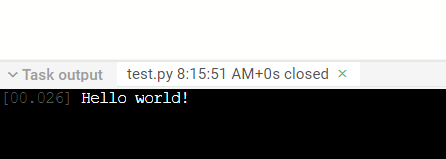
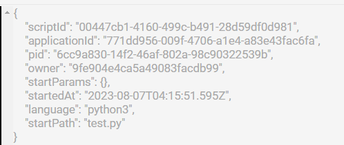

# Инструкция по созданию приложений на Python 3

Цель инструкции: дать подробную информацию об особенностях разработки и запуска приложений на гипервизоре внешних задач Application Manager для программиста.

---

### Список терминов и сокращений, используемых в инструкции
* HV — [`гипервизор`](https://ru.wikipedia.org/wiki/Гипервизор) (диспетчер) внешних задач
* IPC — [`межпроцессная коммуникация`](https://ru.wikipedia.org/wiki/Межпроцессное_взаимодействие)
* Скрипт (python) — файл в папке приложения АМ с расширением `.py` или `.py3`
* Веб-хендлер — часть URL ресурса, задаваемая настройками приложения АМ
* WS — [`веб-сокет`](https://ru.wikipedia.org/wiki/WebSocket).

&nbsp;

## Общая информация

Гипервизор внешних приложений — это программный комплекс, написанный на языке Python 3, созданный для запуска программного обеспечения в заданных условиях окружения с передаваемыми от АМ параметрами.

Application Manager взаимодействует с гипервизором внешних задач по протоколу IPC, работающему на TCP-сокетах, а также по каналам HTTP и WS.

Здесь рассмотрен только запуск и особенности разработки скриптов, написанных на языке Python 3.

&nbsp;

## Быстрый старт

В панели файлов приложения создадим новый скрипт:


Назовём его `test.py`:


Если скрипт не будет помечен, как исполняемый, его невозможно будет запустить напрямую из панели АМ или назначить в веб-хендлере. Также невозможно вызвать его на исполнение как дочернюю задачу. Поэтому нужно выделить его в списке и нажать кнопку `Make executable`:


Для сохранения изменений кода скрипта используется кнопка


которая активируется при изменениях, либо сочетание клавиш `Ctrl+S`.

Добавим в наш скрипт знаменитое `Hello world!` и сохраним изменения:


Проверим, как исполняется наш скрипт. Запустим его кнопкой запуска без параметров.

Код скрипта выполнится, в консоли АМ появится результат работы:



В консоли Application Manager появляется вкладка с именем скрипта, выводившего информацию на печать в консоль, время его запуска, состояние (`closed` при завершении или иное). В окне консоли видно, что скрипт вывел информацию на печать спустя `0.026` секунд после старта задачи.

В правой области консоли показывается информационная панель задачи:



**Внимание!** Информация из этой панели не передаётся задаче. Можно получить лишь часть информации, передаваемой задаче из AM при запуске.

&nbsp;

## Особенности запуска скриптов в АМ

При ручном старте скрипта из панели АМ при каждом запуске будет запускаться отдельный процесс выполнения кода этого скрипта — **задача** (технически перед запуском самой задачи запускается сначала процесс-наблюдатель — observer, но это скрыто от пользователя).

Таким образом, если запустить скрипт 5 раз через панель запуска АМ, то для каждого запуска запустится отдельная задача в контейнере гипервизора.

Можно передать запускаемой задаче параметры в виде [`JSON`](https://ru.wikipedia.org/wiki/JSON), используя кнопку запуска задачи с параметрами. В этот объект параметров также будут добавлены глобальные параметры, если они были установлены через верхнее меню `General Parameters`.

С текущими настройками по умолчанию каждая задача имеет таймаут выполнения `300` секунд  (задается переменной окружения `DEFAULT_TASK_TIMEOUT_SEC`, изменить которую может администратор). Таймаут для конкретной задачи можно изменить, задав при запуске параметр `timeout` и указав количество секунд. Если указать значение меньше `0`, то гипервизор не будет ограничивать задачу по времени выполнения.

Кроме того, с текущими настройками по умолчанию процесс задачи не может занимать в памяти более `100 Мб` (устанавливается переменной окружения `DEFAULT_TASK_MAX_MEMORY_MB`, изменить которую может администратор). Можно тоже изменить это ограничение для конкретной задачи при запуске с параметром `memoryLimit` и указав количество мегабайт.

&nbsp;

## Рабочее окружение скриптов

Гипервизор работает в контейнере Docker, отдельном от АМ. Каждая задача запускается в отдельном процессе. Взаимодействие задач друг с другом, если они запускаются на одном гипервизоре, пока никак не ограничивается. 

&nbsp;

### Файловая система

Программист имеет доступ к папкам операционной системы контейнера гипервизора. Однако, любые изменения файловой системы контейнера не будут сохранены при перезапуске контейнера.

К контейнеру гипервизора также подключено несколько томов-папок (volumes), правила доступа к которым ограничены на уровне скрипта инициализации контейнера.

**/sources** — папка с файлами приложений Application Manager. Подключена в режиме только для чтения. Если администратор даст к этой папке и доступ на запись, то интерпретатор Python сможет автоматически создавать файлы `.pyc` со скомпилированным байт-кодом, которые будут запускаться быстрее при повторных запусках.

**/workdirs** — папка рабочих директорий задач. При старте каждой задачи для неё создается отдельная папка, где в качестве имени папки используется идентификационный номер задачи — pid. Можно хранить в этой папке собственные данные, необходимые при расчётах. Эти файлы не стираются автоматически при перезапусках контейнера гипервизора. Также можно получить данные и из папок других задач, если знать их pid, но это не всегда удобно или вообще возможно при работе.

&nbsp;

### Сетевое окружение

Можно запускать внутри контейнера любое количество серверов, обслуживающих только внутренний локальный сетевой интерфейс контейнера (`127.0.0.1`) на любых доступных портах. Таким образом можно использовать любой доступный инструментарий языка Python 3 для работы с сетью, но пока только внутри контейнера. Также можно взаимодействовать с Application Manager, если знаете его архитектуру и создавать собственные модули и скрипты с собственным API. 

Можно выполнять запросы к сетевым ресурсам — сайтам и серверам. Однако никто из внешней сети пока не может получить доступ к серверу, написанному в виде скрипта и запущенному на гипервизоре.

&nbsp;

### Общее виртуальное окружение задач

Гипервизор запускает все задачи в общем виртуальном окружении с фиксированным набором пакетов. Набор пакетов может различаться, состав набора можно будет узнать по информации в релизах.

&nbsp;

## Работа с локальными пакетами и модулями

### Импорт локальных модулей и пакетов

В приложении АМ можно использовать функционал импорта из модулей или пакетов, обычно используемых в Python.

Например, создадим такую структуру файлов и папок в приложении:


У нас есть стартовый исполняемый файл `test_import_local_module.py` и два модуля, один из которых в пакете `package` со следующим содержимым:

```py
from module1 import module1_print
from package.module2 import module2_print

print('Test local module imports')

module1_print()
module2_print()
```

Код `module1.py`:

```py
print('Imported module 1')

def module1_print():
	print('Print from module 1')
```

Код `module2.py`:

```py
print('Imported module 2')

def module2_print():
	print('Print from module 2')
```

Результат работы скрипта:


Возможно также использовние [`функционала`](https://docs.python.org/3/reference/import.html#packages) файлов `__init__.py` при необходимости.

&nbsp;

<a name="run-child-process"></a>
# Запуск дочерних задач

В AM предусмотрен функционал запуска одной задачи из другой. Родительская задача посылает АМ специальный IPC-пакет для запуска дочерней задачи, и уже АМ запускает её как дочернюю, передавая ей соответствующие параметры. Это позволяет запускать из одной задачи функционал другого скрипта.

Для запуска дочерней задачи нам нужно знать идентификатор скрипта или его имя. Вот простой пример запуска дочерней задачи `child.py` из родительской задачи `parent.py`.

Код дочернего скрипта `child.py`:

```py
print('Print from child')
```

Код родительского скрипта `parent.py`:

```py
from ompy.appmanager.communication import run_am_script

script_id = 'child.py'
script_params = {}
print(f'Запуск дочерней задачи из скрипта {script_id} '
	  f'с параметрами {script_params}')
child_pid = run_am_script(script_id, script_params)

print(child_pid)

print('Завершение родительской задачи')
```

Результат запуска скрипта `parent.py` в консоли АМ:


Можно заметить, что при запуске дочерней задачи `run_am_script` возвращает pid задачи дочернего процесса.

Дочерняя задача может продолжать работу даже после завершения родительской.

**Важно! Дочерняя задача должна быть помечена как исполняемая для успешного запуска! Это поведение отличается от импорта локальных модулей, которые могут быть не помечены как исполняемые, так как импорт осуществляет процесс одного интерпретатора одной задачи.**

Механизм запуска дочерних задач в данный момент реализован в виде простой функции модуля `ompy.appmanager.communication`.

&nbsp;

### Обмен данными между задачами

Пусть есть скрипт, который нужно запустить с входными параметрами и получить его вывод из стандартного потока при завершении. Например, скрипт, который получает числовой параметр и вычисляет его [`факториал`](https://ru.wikipedia.org/wiki/Факториал) и выводит его в [`stdout`](https://ru.wikipedia.org/wiki/Стандартные_потоки). Пример такого скрипта `test_sub.py`:

```py
import sys
import math

number = int(sys.argv[1])
result = math.factorial(number)
print(result)
```

Пример основной задачи `test_run_sub.py`, которая запускает `test_sub.py` и получает результат:

```py
import subprocess
import os
from ompy.appmanager.variables import TASK_PARAMS

def calculate_factorial(number):
	command = ['python', os.path.join(TASK_PARAMS['applicationPath'], 'test_sub.py'), str(number)]
	result = subprocess.check_output(command).decode('utf-8').strip()
	return int(result)

input_number = 5
factorial_result = calculate_factorial(input_number)
print(f'Factorial of {input_number} is: {factorial_result}')
```

Здесь использована переменная `TASK_PARAMS['applicationPath']`, которая хранит путь к папке с исходными файлами приложения. Затем был запущен скрипт `test_sub.py` с помощью модуля `subprocess` и извлечён результат из его вывода `stdout`.

Такой код будет работать очень быстро. Все эти процессы будут работать внутри контейнера гипервизора.

&nbsp;

Архитектурно в AM закладываются методы обмена задач данными друг с другом через AM. Этот функционал пока не реализован для внешних задач в виде какого либо API.

В гипервизоре есть реализованный функционал в виде простого API, позволяющий обмениваться данными только между задачами, исполняемыми на гипервизоре. Можно обмениваться данными с задачей, зная ее pid. В случае с дочерними задачами его можно получить при запуске из родительской.

В будущем возможна реализация обмена данными между задачами любого языка через механизм веб-сокетов Application Manager.

Взаимодействие между задачами реализовано через мост данных веб-сокет — сокет. При старте задачи гипервизор ожидает запрос веб-сокет соединения по адресу `0.0.0.0:RESOURCE_SERVER_LOCAL_PORT/pid`
где `RESOURCE_SERVER_LOCAL_PORT` — порт локального веб-сокет-сервера гипервизора, значение которого — `18564`— установлено в переменной окружения, а pid — идентификатор задачи, который можно получить из параметров запуска. 

Одна задача может подключиться к веб-сокету другой задачи и отправить в него данные. Эти данные будут переданы гипервизором в unix-сокет задачи с этим pid. В свою очередь, задача может ожидать такое подключение на своем сокете и принимать данные по нему от другой задачи.

С помощью этого функционала задачи могут обмениваться друг с другом данными в бинарном или текстовом виде.

### Пример взаимодействия между задачами через веб-сокет — сокет задачи

Допустим, есть задача, рассчитывающая факториал числа, который она получает из своих параметров запуска, передаваемых ей от Application Manager.

Для работы с параметрами, которые получают задачи, а также для получения информации о переменных окружения в API гипервизора реализован модуль `ompy.appmanager.variables` из которого можно получить множество полезных значений, среди которых есть и `TASK_PARAMS` — словарь со значениями параметров, передаваемых задаче. Пример этого словаря при запуске задачи без дополнительных параметров (запуск задачи из панели управления кнопкой Run Script):

```js
{'pid': '94edcac2-3529-4699-8468-d3a0c00696c2', 'parentPid': None, 'applicationPath': '/sources/Manual-N9IBvh', 'scriptPath': 'test_data_exchange_parent.py', 'scriptParams': {}, 'outputPath': '/workdirs/94edcac2-3529-4699-8468-d3a0c00696c2'}
```

По умолчанию все задачи получают в этом словаре данные о своем идентификаторе `pid`, родительском идентификаторе `parentPid`, если эта задача запущена как дочерняя, путь к папке с исходными файлами кода скрипта приложения в контейнере `applicationPath`, путь к скрипту `scriptPath`, параметры, передаваемые скрипту пользователем при ручном запуске или программном запуске как параметры задачи `scriptParams`, а также рабочая директория задачи `outputPath`.

Пример взаимодействия задач через каналы веб-сокеты-сокет, управляемые гипервизором.

Пример дочерней задачи `test_data_exchange_child.py`:

```py
import asyncio, aiohttp
import math
from ompy.appmanager.variables import TASK_PARAMS

async def main():
	factorial_param = TASK_PARAMS['scriptParams'].get('factorial', None)

	if not factorial_param is None:
		print(f'Расчёт факториала числа {factorial_param} в дочерней задаче')
		if not TASK_PARAMS['parentPid'] is None:
			print(f'PID родительской задачи: {TASK_PARAMS['parentPid']}')
			WS_URL = f'http://127.0.0.1:18564/{TASK_PARAMS['parentPid']}'
			print(f'Адрес веб-сокета сокета родительской задачи: {WS_URL}')
			async with aiohttp.ClientSession() as session:
				async with session.ws_connect(WS_URL) as ws:
					result = math.factorial(factorial_param)
					await ws.send_str(f'result is {result}')
					print(f'Результат расчёта факториала {result} отправлен родительской в веб-сокет->сокет задаче')

asyncio.run(main())
```

Пример родительской задачи, запускающей дочернюю и ожидающей от неё результат:

```py
from ompy.appmanager.communication import run_am_script, wait_for_socket_from_web
from ompy.appmanager.observer import read_json_from_observer

script_id = 'test_data_exchange_child.py'
script_params = {'factorial': 5}
print(f'Запуск дочерней задачи рассчета факториала из скрипта {script_id}'
      f' с параметрами {script_params}')
child_pid = run_am_script(script_id, script_params)

print('Ожидаем результат от дочерней задачи')
soc = wait_for_socket_from_web()
message = soc.sync_read_text_message()
print(f'Получен результат из дочерней задачи: {message}')
soc.sync_close()

print('Завершение родительской задачи')
```

Родительская задача запускает дочернюю с параметром `{'factorial': 5}`, а затем ожидает подключения к себе по веб-сокету. Функция `wait_for_socket_from_web` возвращает экземпляр сокета, из которого могут быть получены данные с помощью синхронного метода `sync_read_text_message`.

&nbsp;

[Язык Python](python.md)

[Оглавление](../README.md)
