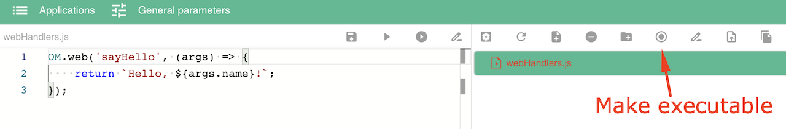
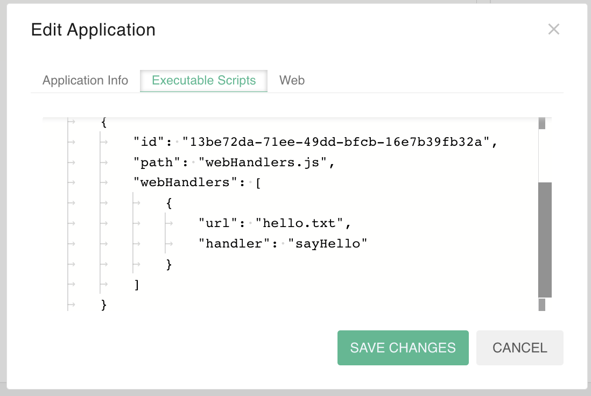
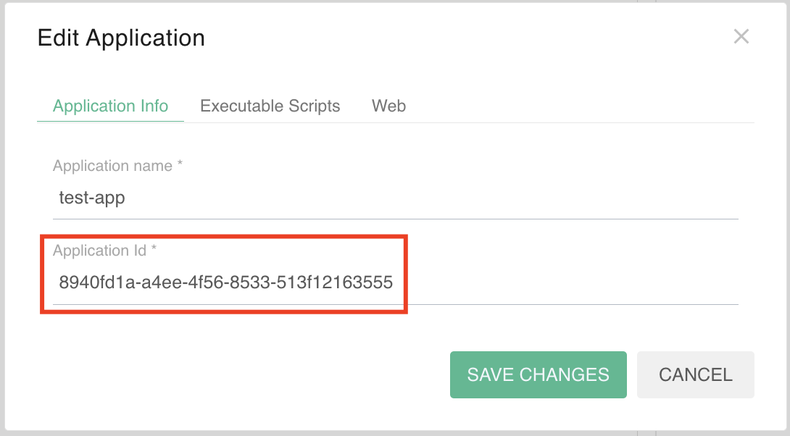
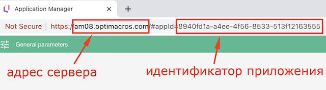
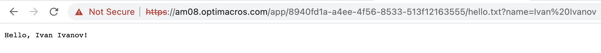
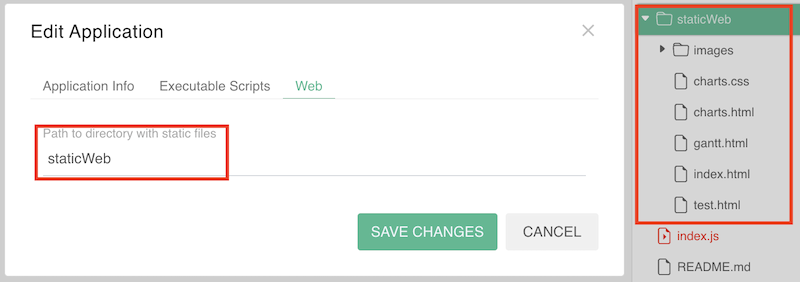

# Веб-интерфейсы<a name="webHandlers"></a>

1. [Создание веб-интерфейсов](#creation)
1. [Настройка приложения](#settings)
1. [Обращение к веб-интерфесам](#request)
1. [Статические файлы](#staticFiles)

&nbsp;

## Создание веб-интерфейсов<a name="creation"></a>

```js
OM.web(eventName: string, callback: (request: OMWebRequest) => string | WebHandlerResponse): void
```

Статический метод интерфейса `OM`. Позволяет создать веб-обработчик с именем `eventName` для взаимодейсвия с другими приложениями, при обращении к которому будет выполняться функция `callback`. 

Входной параметр `request` содержит ссылку на интерфейс `OMWebRequest`.

### Интерфейс OMWebRequest

```ts
interface OMWebRequest {
    method: string,
    headers: { [x: string]: string },
    contentType: string,
    params: {
        appId: string,
        path: string,
    },
    urlRegex?: string[],
    query?: { [x: string]: string },
    body: { [x: string]: string },
}
```

Содержит информацию о запросе, который был передан веб-обработчику.

- `method` - метод HTTP запроса, поддерживаются методы `GET` и `POST`.
- `headers` - заголовки HTTP.
- `contentType` - тип переданного контента.
- `params` содержит идентификатор приложения `appId` и адрес `path`, по которому был отправлен запрос к веб-обработчику.
- `urlRegex` - список групп совпадений адреса в регулярном выражении, если оно было задано, иначе это свойство отсутствует.
- `query` - параметры запроса.
- `body` - тело запроса.

&nbsp;

Функция-обработчик возвращает ответ в формате строки или ссылку на интерфейс `WebHandlerResponse`. 

### Интерфейс WebHandlerResponse
```ts
interface WebHandlerResponse {
    headers: { [x: string]: string };
    body: string;
}
```

Содержит заголовки HTTP `headers` и тело ответа `body` в формате строки.

&nbsp;

В функций веб-обработчиков нельзя устанавливать соединение с моделью через [OM.connect](../diff.md#modelConnect), можно только выполнять асинхронную операцию соединения [OM.connectAsync](../diff.md#connectAsync).

&nbsp;

## Настройка приложения<a name="settings"></a>

В настройках приложения в диалоговом окне `Edit Application` на вкладке `Executable Scripts` для исполняемого скрипта можно добавить список сопоставлений URL адресов и веб-обработчиков, созданных в этом скрипте. Один веб-обработчик может иметь любое количество адресов. При обращении по такому URL адресу будет происходить вызов функции соответствующего веб-обработчика.

Сопоставления URL адресов и веб-обработчиков задаются списком в свойстве `webHandlers`. Каждое такое сопоставление описывается с помощью следующих свойств:
- `handler` - название веб-обработчика, которое указано при его создании в функции [OM.web](#creation).
- `url` - URL адрес обращения к веб-обработчику. 

URL адреса могут быть заданы с помощью [регулярного выражения](https://ru.wikipedia.org/wiki/Регулярные_выражения). В этом случае вместо свойства `url` нужно указать свойство `urlRegex`, значением которого является регулярное выражение.

### Пример

1. Создать веб-обработчик с помощью функции [OM.web](#creation).
2. Сделать скрипт **исполняемым**.



3. Добавить список сопоставлений URL адресов и веб-обработчиков в настройках приложения.



&nbsp;

## Обращение к веб-интерфесам<a name="request"></a>

Сторонее приложение может обращаться к веб-интерфесам с помощью HTTP запросов. При обращении к ресурсу сначала происходит поиск подходящего веб-обработчика в скриптах приложения. Если обработчик не найден - поиск [статического файла](#staticFiles) с совпадающим путем.

URL адрес обращения к веб-интерфесу формируется следующим образом: `https://<HOST>/app/<APP ID>/<URL>`, где
- `<HOST>` - адрес сервера, на котором установлена система Application Manager,
- `<APP ID>` - идентификатор приложения,
- `<URL>` - адрес обращения к веб-обработчику.

### Пример

1. Формируем URL адрес обращения к веб-обработчику из примера выше.
- Система Application Manager находиться на сервере по адресу `am08.optimacros.com`.
- Идентификатор приложения можно узнать в диалоговом окне `Edit Application`->`Application Info`.



Или из адресной строки в браузере.



- Веб-обработчик реагирует на адрес `hello.txt` и принимает входной параметр `name`.

Получаем URL адрес обращения к веб-обработчику

`https://am08.optimacros.com/app/8940fd1a-a4ee-4f56-8533-513f12163555/hello.txt?name=Ivan%20Ivanov`

2. Отправляем HTTP GET-запрос из адресной строки в браузере и получаем результат выполнения.



&nbsp;

## Статические файлы<a name="staticFiles"></a>

В настройках приложения в диалоговом окне `Edit Application` на вкладке `Web` можно указать папку, все файлы которой будут передаваться стороннему приложению в том виде как они есть.

### Пример

В приложении есть папка `staticWeb` со статическими файлами.



Например, статический файл `index.html` будет доступен по адресу 

`https://am08.optimacros.com/app/8940fd1a-a4ee-4f56-8533-513f1216355/index.html`

&nbsp;

[Оглавление](../README.md)
