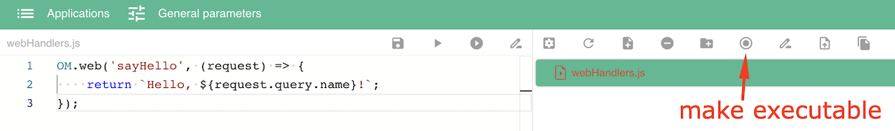

# Взаимодействие с другими приложениями<a name="webHandlers"></a>

## Создание веб-интерфейсов<a name="сreation"></a>

```js
OM.web(eventName: string, callback: (request: Object) => string | WebHandlerResponse): void
```

Статический метод интерфейса `OM`. Позволяет создать веб-обработчик с именем `eventName` для взаимодействия с другими приложениями. Вторым аргументом указывается `callback` функция, которая будет выполняться каждый раз когда стороннее приложение обращается к веб-обработчику. 

Функция `callback` принимает на вход параметр `request` в виде объекта, который содержит следующие свойства:
- `appId` - индентификатор приложения,
- `path` - URL адрес, по которому был отправлен запрос к веб-обработчику,
- параметры, переданные в запросе,
- `urlRegex` - список групп совпадений URL адреса в регулярном выражении, если оно было задано, иначе это свойство отсутствует,

Возвращает ответ в виде строки или объекта класса `WebHandlerResponse`. 

### Интерфейс WebHandlerResponse<a name="WebHandlerResponse"></a>
```ts
interface WebHandlerResponse {
    headers: { [x: string]: string };
    body: string;
}
```

В функций веб-обработчиков нельзя устанавливать соединение с моделью через [OM.connect](../diff.md#modelConnect), можно только выполнять асинхронную операцию соединения [OM.connectAsync](../diff.md#connectAsync).

&nbsp;

## Настройка приложения

В настройках приложения для каждого исполняемого скрипта можно добавить список URL адресов, при обращении к которым будет происходить вызов функции веб-обработчика из скрипта.

### Описание и пример настройки приложения

1. Создать скрипт и описать в нем веб-интерфесы с помощью функции [OM.web](#creation).
2. Сделать скрипт **исполняемым**.



3. Добавить описание веб-обработчиков в файл манифеста `omapp.json`. В интерфейсе системы `Application Manager` файл манифеста редактируется в диалоговом окне `Edit Application` на вкладке `Executable Scripts`.


В описание исполняемого скрипта нужно добавить свойство `webHandlers`, значением которого является список сопостовлений URL адресов и веб-обработчиков, созданных в этом скрипте. Один веб-обработчик может иметь любое количесво адресов. Каждое такое сопоставление описывается с помощью следующих свойств:
- `handler` - название веб-обработчика, которое указано при его создании в функции [OM.web](#creation).
- `url` - URL адрес обращения к веб-обработчику. 

URL адрес может быть задан с помощью [регулярного выражения](https://ru.wikipedia.org/wiki/Регулярные_выражения). В этом случае вместо свойства `url` нужно указать свойство `urlRegex`, значением которого является регулярное выражение.

&nbsp;

## Обращение к веб-интерфесам

Сторонее приложение может обращаться к веб-интерфесам с помощью HTTP запросов. При обращении к ресурсу сначала происходит поиск подходящего веб-обработчика в скриптах приложения, если обработчик не найден - поиск [статического файла](#staticFiles) с совпадающим путем.

URL адрес обращения к веб-интерфесу формируется следующим образом: `https://<HOST>/app/<APP ID>/<URL>`, где
- `<HOST>` - адрес сервера, на котором установлена система `Application Manager`,
- `<APP ID>` - идентификатор приложения,
- `<URL>` - адрес обращения к веб-обработчику.

### Пример

1. Формируем URL адрес обращения к веб-обработчику из примера выше.
- Система `Application Manager` находиться на сервере по адресу `am08.optimacros.com`.
- Идентификатор приложения можно узнать в диалоговом окне `Edit Application`->`Application Info`.


- Веб-обработчик реагирует на адрес `hello.txt` и принимает входной параметр `name`.

Получаем URL адрес обращения к веб-обработчику

`https://am08.optimacros.com/app/8940fd1a-a4ee-4f56-8533-513f12163555/hello.txt?name=Ivan%20Ivanov`

2. Отправляем HTTP GET-запрос из адресной строки в браузере и получаем результат выполнения.


&nbsp;

## Статические файлы<a name="staticFiles"></a>

В настройках приложения в диалоговом окне `Edit Application` на вкладке `Web` можно указать папку, все файлы которой будут передаваться стороннему приложению в том виде как они есть.

### Пример

В приложении есть папка `staticWeb` со статическими файлами.


Например, статический файл `index.html` будет доступен по адресу 

`https://am08.optimacros.com/app/8940fd1a-a4ee-4f56-8533-513f1216355/index.html`

&nbsp;

[Оглавление](../README.md)
